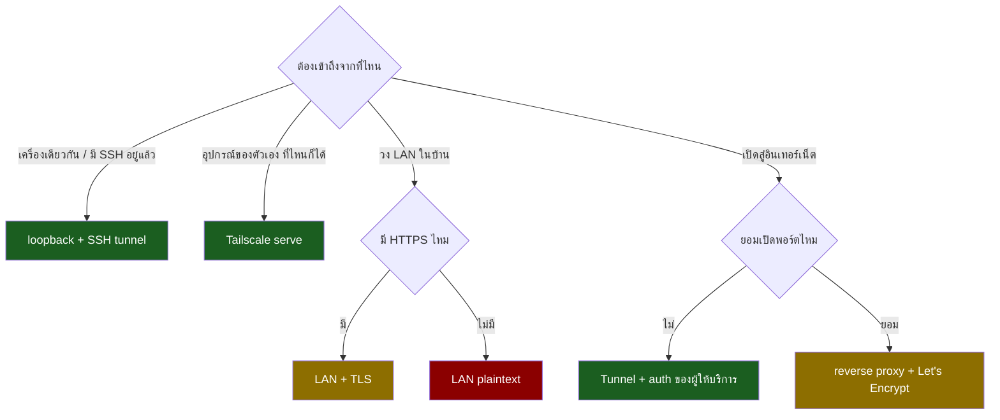

# ทำให้ browser-console เปิด opensource ได้ — วิธี deploy และความปลอดภัย

**คำถาม:** ถ้าเปิด repo นี้ให้คนอื่นใช้ เขาต้องเลือกวิธี deploy ได้เอง (Tailscale
หรือวิธีอื่น) โดยยังปลอดภัย — ตอนนี้มีอะไรขวางอยู่บ้าง

**สรุปสั้น:** โค้ดตอนนี้ถูกต้องสำหรับสภาพแวดล้อมเดียวคือ "อยู่หลัง `tailscale serve`
บนเครื่องตัวเอง" และสมมติฐานนั้นถูก**ฝังลงไปในโค้ดแบบแก้ไม่ได้ 4 จุด** ไม่ใช่แค่ config
ที่แย่ที่สุดคือสองจุดที่พังแบบ **ไม่มี error ให้เห็น** ผู้ใช้จะเจออาการ "กรอกรหัสถูกแล้ว
แต่เข้าไม่ได้" แล้วไปโทษรหัสผ่านตัวเอง

เอกสารนี้แยกเป็นสามส่วน: สิ่งที่ต้องแก้ก่อนเผยแพร่ · โหมดการ deploy ที่ควรรองรับ ·
ชั้นความปลอดภัยที่แต่ละโหมดต้องการ

---

## 0. เดิมพันคืออะไร

ต้องพูดให้ชัดก่อน เพราะมันกำหนดว่ามาตรการแต่ละอย่างคุ้มหรือไม่คุ้ม

**แอปนี้คือการรันโค้ดอะไรก็ได้จากระยะไกล โดยเจตนา** ใครก็ตามที่ผ่านหน้า login ไปได้
จะได้ shell ที่มีสิทธิ์เท่ากับผู้ใช้ที่รัน service อยู่ — อ่านไฟล์ทุกไฟล์ที่คนนั้นอ่านได้
ใช้ SSH key ที่มีอยู่ ต่อไปยังเครื่องอื่นในเครือข่ายได้ ไม่มีการจำกัดขอบเขตใดๆ ทั้งสิ้น

ผลที่ตามมาสามข้อ:

1. **รหัสผ่านคือกำแพงทั้งหมด** ในโหมดที่ไม่มีการยืนยันตัวตนชั้นเครือข่าย ไม่มีชั้นสองรองรับ
2. **"แค่ LAN ในบ้าน" ไม่ใช่ขอบเขตที่ไว้ใจได้** อุปกรณ์ IoT ที่ถูกเจาะ แขกที่ต่อ WiFi
   หรือเพื่อนบ้านที่เดารหัส WiFi ได้ ล้วนอยู่ในวงเดียวกันหมด
3. **ควรรันด้วยผู้ใช้ธรรมดา ไม่ใช่ root** เอกสารและ `browser-console.service` ต้อง
   พูดเรื่องนี้ให้ชัด เพราะคนที่รันใน container มักรันเป็น root โดยไม่รู้ตัว

เทียบกับแอปทั่วไปที่ "ถูกเจาะแล้วข้อมูลรั่ว" — อันนี้ถูกเจาะแล้ว**เสียเครื่องทั้งเครื่อง**
นั่นคือเหตุผลที่เอกสารนี้ให้น้ำหนักกับการยืนยันตัวตนชั้นเครือข่าย (Tailscale, SSH,
Cloudflare Access) มากกว่าการไปขัดเกลารหัสผ่านของเราเอง

---

## 1. สมมติฐานที่ฝังอยู่ในโค้ด

ทั้งหมดนี้ตรวจจากโค้ดจริง ไม่ใช่การคาดเดา

### 1.1 ผูกกับ 127.0.0.1 ตายตัว — `server/index.ts:131`

```ts
new Promise<void>(r => http.listen(port, '127.0.0.1', () => r()))
```

เครื่องอื่นต่อไม่ได้เลย ไม่ว่าจะเปิด firewall หรือ forward port อย่างไร ตอนออกแบบ
ตั้งใจแบบนี้เพราะ `tailscale serve` อยู่บนเครื่องเดียวกันแล้ววิ่งเข้ามาทาง loopback —
เป็นการตัดสินใจที่ดีสำหรับกรณีนั้น แต่พอถอด Tailscale ออกมันกลายเป็นกำแพงทันที

**อาการที่ผู้ใช้เจอ:** connection refused จากเครื่องอื่น ทั้งที่ service ขึ้นปกติ

### 1.2 cookie ติดธง `Secure` เสมอ — `server/index.ts:36`

```ts
return `${COOKIE_NAME}=${token}; HttpOnly; Secure; SameSite=Strict; ...`;
```

เบราว์เซอร์ปฏิเสธเก็บ cookie ที่มีธง `Secure` บน origin ที่ไม่ใช่ HTTPS **โดยไม่แจ้ง
อะไรเลย** ทดสอบผ่าน IP วง LAN จริง (192.168.1.50) ได้ผลตามนี้:

```
POST /api/login   → 200 OK  + Set-Cookie: ...; Secure
GET  /api/session → 401     ← เบราว์เซอร์ทิ้ง cookie เงียบๆ
```

**อาการที่ผู้ใช้เจอ:** กรอกรหัสถูก หน้าเว็บกระพริบแล้ววนกลับหน้า login ตลอดกาล

ที่หลอกที่สุดคือ **ทดสอบบน `localhost` จะผ่านเสมอ** เพราะเบราว์เซอร์ยกเว้น loopback
ให้นับเป็น secure context — คนพัฒนาจะไม่มีวันเจอบั๊กนี้บนเครื่องตัวเอง เห็นเฉพาะตอน
ยิงจาก IP วง LAN จริงเท่านั้น (ผมต้องทำ port forward ไปทดสอบถึงจะเจอ)

### 1.3 rate limit เป็นแบบรวม ไม่แยกตาม IP — `server/ratelimit.ts`

ตั้งใจไว้แบบนี้ และ**ถูกแล้วสำหรับสถาปัตยกรรมปัจจุบัน** เพราะทุก request มาจาก
`127.0.0.1` เหมือนกันหมด การแยก bucket ตาม IP จึงไม่มีความหมาย

แต่พอเปิดออกสู่เครือข่ายจริง ตรรกะนี้กลับด้าน กลายเป็นช่องโหว่สองทางพร้อมกัน:

- **ล็อกเจ้าของออกจากระบบได้** — ใครก็ตามที่ยิงรหัสผิด 10 ครั้งใน 1 นาที ทำให้
  เจ้าของเครื่องล็อกอินไม่ได้ไปด้วย เป็น DoS ที่ต้นทุนต่ำมาก
- **เพดานเดารหัสยังสูง** — 10 ครั้ง/นาที = 14,400 ครั้ง/วัน ซึ่งพอสำหรับเดารหัสที่
  ไม่แข็งแรงจริง

### 1.4 เทียบรหัสผ่านแบบ plaintext — `server/auth.ts`

```ts
export function verifyPassword(input: string, expected: string): boolean {
  return safeEqual(input, expected);   // expected คือค่าดิบจาก .env
}
```

การเทียบใช้ `timingSafeEqual` ถูกต้องแล้ว แต่ตัวรหัสผ่านเก็บเป็น plaintext ใน `.env`
สำหรับเครื่องส่วนตัวพอรับได้ แต่พอเป็น opensource ที่คนเอาไปวางบนเซิร์ฟเวอร์จริง
ควรเก็บเป็น hash — Node มี `crypto.scrypt` ในตัว **ไม่ต้องเพิ่ม dependency เลย**

---

## 2. ปัญหาที่กระทบ "ใช้ได้โดยไม่มี herdr" โดยตรง

ข้อนี้ไม่ได้อยู่ในคำถามเรื่องเครือข่าย แต่เป็นเรื่องเดียวกันในทางปฏิบัติ

**ไม่มี WebSocket keepalive เลย** (ตรวจแล้ว ไม่มี ping/pong/heartbeat ในโค้ด) ขณะที่:

- Cloudflare Tunnel ตัด WebSocket ที่ไม่มี traffic ราว **100 วินาที**
- nginx ตั้ง `proxy_read_timeout` ไว้ **60 วินาที** เป็นค่า default

เทอร์มินัลที่เปิดทิ้งไว้เฉยๆ คือ traffic ศูนย์ — จึงโดนตัดเป็นเรื่องปกติ ไม่ใช่กรณีพิเศษ

ตอนนี้ไม่เจ็บเพราะ **herdr รับความเสียหายไว้ให้ทั้งหมด** — ต่อใหม่ก็ attach กลับ
session เดิม แต่คนที่ตั้ง `SHELL_CMD=bash` จะเจอว่า

```
เปิดทิ้งไว้ 2 นาที → หลุด → ต่อใหม่ = PTY ใหม่ = shell ตาย งานที่ค้างอยู่หายหมด
```

**แต่ keepalive แก้ปัญหานี้ได้แค่ครึ่งเดียว — ต้องไม่ขายเกินจริง** มันกันเฉพาะการหลุด
เพราะ *ไม่มี traffic* ส่วนการหลุดที่เกิดจากมือถือเปลี่ยนเสาสัญญาณ หน้าจอดับ WiFi สลับ
หรือเดินออกนอกระยะ ยังฆ่า PTY เหมือนเดิมทุกประการ และสำหรับแอปที่ออกแบบมาเพื่อมือถือ
**นั่นคือกรณีปกติ ไม่ใช่กรณียกเว้น** (โค้ดใน `web/main.ts` เขียนกำกับไว้เองว่าเน็ตมือถือ
สะดุดคือสถานการณ์อันดับหนึ่งของแอปนี้)

การจะพูดได้เต็มปากว่า "ใช้ได้โดยไม่มี herdr" ต้องเลือกหนึ่งในสองทาง:

- **ทางถูก:** ประกาศให้ชัดว่า persistence ไม่ใช่หน้าที่ของแอปนี้ แล้วแนะนำให้ตั้ง
  `SHELL_CMD` เป็น `tmux new -A -s web` หรือ `herdr` — เอกสารเป็นคนแก้ ไม่ใช่โค้ด
- **ทางแพง:** ให้ PTY อยู่รอดฝั่ง server แล้ว attach กลับตอนต่อใหม่ พร้อม replay
  ประวัติหน้าจอ — เป็นฟีเจอร์ก้อนใหญ่ ไม่ควรอยู่ในรอบเดียวกับงานความปลอดภัย

ผมเสนอทางถูก และให้ keepalive ทำหน้าที่ของมันตามจริงคือ **กันการหลุดตอนเปิดทิ้งไว้
เฉยๆ ซึ่งเป็นกรณีที่พบบ่อยที่สุดและน่ารำคาญที่สุด** ไม่ใช่แก้เรื่อง persistence

---

## 3. โหมดการ deploy ที่ควรรองรับ



| โหมด | TLS | ใครยิงหน้า login ได้ | ต้องแก้โค้ดอะไร | เหมาะกับ |
|---|---|---|---|---|
| **loopback + SSH tunnel** | ไม่ต้อง (SSH ห่อให้) | เฉพาะคนที่มี SSH key | ไม่ต้องแก้โค้ด — ตั้ง origin เท่านั้น | นักพัฒนา |
| **Tailscale serve** | ฟรีจาก Tailscale | เฉพาะเครื่องใน tainet | ไม่ต้องแก้ (ปัจจุบัน) | มือถือส่วนตัว |
| **Tunnel + Cloudflare Access** | ฟรีจากผู้ให้บริการ | เฉพาะคนที่ผ่าน Access | keepalive | เข้าจากเน็ตนอก |
| **LAN + TLS** | ต้องหาเอง | ทุกคนในวง LAN | HOST + Secure ตามโปรโตคอล | ใช้ในบ้าน |
| **reverse proxy สาธารณะ** | Let's Encrypt | **ทั้งอินเทอร์เน็ต** | ครบทุกข้อในหมวด 4 | คนที่รู้ว่าทำอะไรอยู่ |
| **LAN แบบ plaintext** | ไม่มี | ทุกคนในวง LAN + ดักอ่านได้ | HOST + ปิด Secure | ไม่ควรทำ |

### หมายเหตุแต่ละโหมด

**loopback + SSH tunnel** (`ssh -L 7000:localhost:7000 host`) — ใช้ได้ตั้งแต่วันนี้
โดยไม่ต้องแก้โค้ด แต่**ไม่ใช่ว่าใช้ได้ทันทีโดยไม่ตั้งอะไร**: เบราว์เซอร์จะเปิดที่
`http://localhost:7000` ซึ่งไม่มีอยู่ใน `ALLOWED_ORIGINS` ที่มากับ `.env.example`
(มีแค่ `:5173` กับ origin ของ tainet) — WebSocket จะโดนปฏิเสธ 403 จนกว่าจะเติมเอง
ข้อนี้ต้องเขียนใน README ให้ชัด เพราะเป็นโหมดที่แนะนำเป็นอันดับแรก

ที่เหลือปลอดภัยที่สุดในบรรดาทั้งหมด เพราะ SSH จัดการทั้ง TLS และ
การยืนยันตัวตนให้หมด ควรเขียนไว้ใน README เป็นทางเลือกแรกสำหรับนักพัฒนา

ข้อเสียคือมันย้อนแย้งกับเหตุผลที่สร้างโปรเจกต์นี้ (หนีจากแอป SSH บนมือถือ) — แต่
สำหรับ**คนอื่นที่เอาไปใช้**มันคือทางที่คุ้มที่สุดระหว่างความปลอดภัยกับความยุ่งยาก

**Tunnel + Cloudflare Access** — น่าสนใจที่สุดสำหรับคนที่ต้องเข้าจากเน็ตนอก เพราะ
**ผู้โจมตีไม่มีทางไปถึงแอปเราเลย** ต้องผ่านการยืนยันตัวตนของ Cloudflare ก่อน
รหัสผ่านของเราจึงกลายเป็นชั้นที่สอง ไม่ใช่ชั้นเดียว ฟรีถึง 50 ผู้ใช้ ไม่ต้องเปิดพอร์ต
ไม่ต้องมี IP นิ่ง — แลกกับการเชื่อใจ Cloudflare และต้องมี keepalive

**LAN แบบ plaintext** — รหัสผ่านและ session วิ่งเปลือยบนสาย ใครก็ตามในวง WiFi
เดียวกันดักอ่านแล้วเอา cookie ไปใช้ต่อได้ทันที และ cookie นั้นใช้ได้ **30 วัน**
(ดูหมวด 4.3) ผมคิดว่าควร**รองรับ** เพราะคนจะทำอยู่ดี แต่ต้องบังคับให้ตั้งใจเปิดเอง
ด้วยตัวแปรที่ชื่อชัดเจน ไม่ใช่เกิดขึ้นเองโดยบังเอิญ

---

## 4. ชั้นความปลอดภัยที่ต้องเพิ่ม

เรียงตามความคุ้มค่า ไม่ใช่ตามความยาก

### 4.1 สิ่งที่ต้องมีก่อนเผยแพร่ (ไม่มีไม่ได้)

**`HOST` เป็น config โดย default ยังเป็น `127.0.0.1`** — ค่า default ต้องปลอดภัย
คนที่อยากเปิดออกต้องพิมพ์มันเองอย่างตั้งใจ

**ทางเลือกที่ง่ายกว่าและทำไมถึงตกไป:** ทางที่ง่ายที่สุดคือไม่ต้องมี `HOST` เลย —
bind loopback ตลอดกาล แล้วประกาศว่าใครอยากเปิดออกให้ไปใช้ reverse proxy เอา
(หมวด 4.1 ข้อ 2, 3 ส่วนใหญ่หายไปด้วย) แต่ตกไปเพราะ **container bind loopback ไม่ได้**
ในคอนเทนเนอร์ loopback คือ loopback ของคอนเทนเนอร์เอง ไม่มีอะไรเข้าถึงได้เลยแม้แต่ host

เหตุผลที่หนักแน่นที่สุดของข้อนี้จึงไม่ใช่ LAN แต่คือ **container** — ในคอนเทนเนอร์ต้อง bind
`0.0.0.0` เสมอ ไม่งั้นไม่มีอะไรเข้าถึงได้แม้แต่ตัว host เอง ขณะที่ความปลอดภัยไปอยู่ที่
การ publish port (`-p 127.0.0.1:7000:7000`) แทน ตอนนี้ repo **ยังไม่มี Dockerfile เลย**
ทั้งที่นั่นคือวิธีที่คนแปลกหน้าน่าจะหยิบไปรันมากที่สุด — ควรมีคู่กับ `HOST` ในก้อนเดียวกัน
และตั้ง `USER` ที่ไม่ใช่ root ใน image ตามเหตุผลในหมวด 0

**ธง `Secure` ต้องตามโปรโตคอลจริง** — ข้อควรระวัง: **ห้ามยุบให้เหลือ origin เดียว**
ตอนพัฒนา เบราว์เซอร์อยู่ที่ `:5173` (vite) แต่ server อยู่ `:7000` — Origin ที่ server
เห็นคือ `http://localhost:5173` ไม่ใช่ origin ของ production (`vite.config.ts` ตั้ง
proxy `/api` กับ `/pty` ไว้) ปัจจุบัน `.env.example` จึงมีสองค่าอย่างมีเหตุผล การยุบ
เหลือค่าเดียวทำให้ `pnpm dev:web` ใช้ไม่ได้

โครงที่รองรับทั้งสองอย่างโดยไม่เปิดช่องให้ตั้งผิด:

| ตัวแปร | หน้าที่ | หมายเหตุ |
|---|---|---|
| `PUBLIC_ORIGIN` | origin ที่ผู้ใช้เปิดจริง — คุมธง `Secure` และอนุญาตอัตโนมัติ | จำเป็น มีค่าเดียว |
| `DEV_ORIGINS` | origin เพิ่มเติมตอนพัฒนา | ยอมรับเฉพาะเมื่อ `NODE_ENV !== 'production'` |

ธง `Secure` ตัดสินจาก scheme ของ `PUBLIC_ORIGIN` เท่านั้น (ค่าเดียว ไม่กำกวม) ส่วน
`DEV_ORIGINS` ถูกเมินใน production จึงเป็นไปไม่ได้ที่ origin สำหรับ dev จะหลุดติดไปด้วย

**ปฏิเสธที่จะ start ถ้า config อันตราย** — ตอนนี้ `required()` เช็คแค่ว่าไม่ว่าง
แปลว่ารันด้วย `CONSOLE_PASSWORD=changeme` (ค่าใน `.env.example`) ได้สบายๆ

เงื่อนไขต้องเขียนจากสิ่งที่แอป**ตรวจได้จริง** — แอปอยู่หลัง proxy เสมอ จึงไม่มีทางรู้ว่า
upstream เปิด TLS ไหม สิ่งที่รู้คือค่า config ของตัวเอง:

- รหัสผ่านตรงกับค่าตัวอย่าง หรือสั้นกว่าเกณฑ์ → ไม่ยอม start
- `SESSION_SECRET` ยังเป็นค่า placeholder หรือสั้นเกินไป → ไม่ยอม start
- `PUBLIC_ORIGIN` เป็น `http://` **และ host ของมันไม่ใช่ loopback**
  (`localhost` / `127.0.0.1` / `::1`) → ไม่ยอม start เว้นแต่ตั้ง `ALLOW_INSECURE=1`

ข้อสุดท้ายคือจุดที่ทำให้ "LAN แบบ plaintext" เป็นการตัดสินใจที่ต้องพิมพ์เอง ไม่ใช่
สิ่งที่ไถลไปโดนเอง

**ตัวชี้วัดต้องเป็น `PUBLIC_ORIGIN` ไม่ใช่ `HOST`** — จุดนี้พลาดง่ายมาก กฎที่ดูสมเหตุสมผล
กว่าคือ "`HOST` ไม่ใช่ loopback + เป็น http → ห้าม" แต่มันเด้งผิดกับ Docker ที่ตั้งถูกต้อง
ที่สุด:

```
HOST=0.0.0.0                       ← บังคับ ในคอนเทนเนอร์ไม่มีทางเลือกอื่น
-p 127.0.0.1:7000:7000             ← เปิดให้เฉพาะ loopback ของ host
PUBLIC_ORIGIN=http://localhost:7000
```

ชุดนี้ปลอดภัยจริง ไม่มี traffic ออกนอกเครื่องเลย แต่กฎแบบ `HOST` จะห้าม ผู้ใช้ก็จะตั้ง
`ALLOW_INSECURE=1` แล้ว**เคยชินกับการปิดกลไกป้องกัน** ซึ่งทำลายคุณค่าของมันทั้งหมด

สิ่งที่กำหนดว่า cookie วิ่งเปลือยบนสายหรือไม่ คือ**สิ่งที่เบราว์เซอร์คุยด้วย** ไม่ใช่
สิ่งที่ process นี้ bind อยู่ — `PUBLIC_ORIGIN` จึงเป็นตัวชี้วัดที่ถูกต้องเพียงตัวเดียว

**WebSocket keepalive** — เหตุผลตามหมวด 2 กระทบทั้งเรื่อง tunnel และเรื่อง
"ใช้ได้โดยไม่มี herdr"

### 4.2 ควรมีสำหรับคนที่เปิดสู่อินเทอร์เน็ต

**เก็บรหัสผ่านเป็น hash** — `crypto.scrypt` มีใน Node อยู่แล้ว พร้อมสคริปต์
`pnpm hash-password` ให้ผู้ใช้สร้างค่าไปใส่ `.env`

**rate limit แยกตาม IP + หน่วงแบบทวีคูณ** ต้องมาคู่กับ `TRUST_PROXY` เพราะถ้าอยู่
หลัง proxy ต้องอ่าน IP จริงจาก `X-Forwarded-For` — และ**ห้ามเชื่อ header นี้โดย
อัตโนมัติ** ไม่งั้นผู้โจมตีปลอม IP ตัวเองหนี rate limit ได้ทุกครั้ง ต้องให้ผู้ใช้
ประกาศเองว่าอยู่หลัง proxy ที่เชื่อได้

> **ยังไม่ได้ยืนยัน:** `tailscale serve` ส่ง `X-Forwarded-For` มาให้หรือไม่ ผมยังไม่ได้
> ตรวจกับของจริง ถ้าไม่ส่ง การแยก bucket ตาม IP จะไร้ผลในโหมด Tailscale (ทุก request
> จะดูเหมือนมาจาก IP เดียว) ซึ่งไม่เป็นไรนัก เพราะโหมดนั้นมีการยืนยันตัวตนชั้น tainet
> อยู่แล้ว — แต่ต้องตรวจก่อนลงมือ ไม่ใช่สมมติเอา

ควรคง bucket รวมไว้เป็นเพดานอีกชั้นด้วย เพื่อกันการยิงจากหลาย IP พร้อมกัน

### 4.3 ช่องโหว่ที่มีอยู่แล้ว และจะเจ็บขึ้นมากเมื่อเปิดออก

**logout ไม่ได้เพิกถอน session จริง** — `/api/logout` แค่สั่งเบราว์เซอร์ลบ cookie
(`server/index.ts`) ตัว token ยัง valid ต่อไปจนหมดอายุ เพราะมันคือ HMAC ที่ตรวจได้
ด้วยตัวเอง ไม่มีสถานะฝั่ง server

แปลว่า **ถ้า cookie รั่ว การกด logout ไม่ช่วยอะไรเลย** ผู้โจมตียังเข้าได้อีก 30 วัน

ทางแก้ที่เบาที่สุดคือใส่ตัวนับ epoch ลงใน payload ที่เซ็น (`<epoch>.<expiry>.<hmac>`)
แล้วให้ logout เพิ่มค่านั้น — token เก่าทั้งหมดตายทันที แต่**ต้องตัดสินใจก่อนว่าเก็บ
ตัวนับไว้ที่ไหน** เพราะสองทางเลือกให้พฤติกรรมต่างกันคนละเรื่อง:

| เก็บที่ | ผลตอน restart service | ความยุ่งยาก |
|---|---|---|
| หน่วยความจำ | **ทุก session หลุดหมด ต้องล็อกอินใหม่** | ไม่มีเลย |
| ไฟล์ข้าง `.env` | session อยู่รอด ตามที่ผู้ใช้คาดหวัง | ต้องจัดการสิทธิ์ไฟล์และ error ตอนเขียน |

ผมเสนอ**แบบไฟล์** เพราะจุดขายทั้งหมดของ cookie 30 วันคือไม่ต้องพิมพ์รหัสบนมือถือบ่อยๆ
ถ้า `systemctl restart` หรือ reboot แล้วต้องพิมพ์ใหม่ทุกครั้ง ฟีเจอร์นั้นก็ตายไปด้วย

**อายุ session 30 วัน ยาวเกินไปสำหรับระบบที่เปิดสู่สาธารณะ** — ควรปรับได้ และ
default สั้นลงเมื่อไม่ได้อยู่บน loopback

### 4.4 ทางเลือกเสริม (ไม่จำเป็นสำหรับรุ่นแรก)

**mTLS / client certificate** — `ttyd` รองรับผ่าน `--ssl-ca` เป็นการยืนยันตัวตน
ที่แข็งแรงมากสำหรับเครื่องมือส่วนตัว เพราะคนที่ไม่มี cert จะเข้าไม่ถึงแม้แต่หน้า login
ติดตั้ง cert บน Android ได้แต่ยุ่งพอสมควร

**TOTP 2 ชั้น** — ตรงไปตรงมา แต่เพิ่ม dependency และงานดูแล ถ้าใครต้องการระดับนี้
จริง แนะนำให้ไปใช้ tunnel + Access แทนจะคุ้มกว่า

---

## 5. เทียบกับของที่มีอยู่แล้ว

`ttyd` เป็นตัวเทียบที่ตรงที่สุด (C, xterm.js เหมือนกัน, โตแล้ว) สิ่งที่มันมีแล้วเราไม่มี:

| ความสามารถ | ttyd | เรา |
|---|---|---|
| เลือก interface ที่จะ bind | `-i` (รวม UNIX socket) | ตายตัวที่ loopback |
| TLS ในตัว + mTLS | `-S` / `-A` | ไม่มี (พึ่ง proxy) |
| ตรวจ Origin | `-O` | มี (บังคับเสมอ) |
| **อ่านอย่างเดียวเป็นค่า default** | `-W` ถึงจะเขียนได้ | เขียนได้เสมอ |
| จำกัดจำนวน client | `-m` | บังคับ session เดียว |

ข้อที่น่าสนใจที่สุดคือ **ttyd ให้อ่านอย่างเดียวเป็นค่า default** — ต้องเติม `-W`
ถึงจะพิมพ์ได้ เป็นแนวคิด "ค่าเริ่มต้นต้องปลอดภัย" ที่ควรยืมมาคิด แม้กับเราจะแปลกๆ
เพราะจุดประสงค์ทั้งหมดคือการพิมพ์คำสั่ง

จุดที่เราดีกว่าและควรรักษาไว้: UI สำหรับมือถือโดยเฉพาะ (แถวปุ่ม, ท่าทาง touch,
จัดการคีย์บอร์ดบนจอ) — ttyd ไม่มีอะไรพวกนี้เลย **นี่คือเหตุผลที่โปรเจกต์นี้ควรมีอยู่**
และควรเป็นสิ่งที่ README ชูเป็นอันดับแรก

---

## 6. เรื่องที่ต้องทำก่อนกด publish

**ชื่อ tailnet ส่วนตัวโผล่ใน 5 ไฟล์** — `README.md`, `.env.example` และ `docs/` อีก 3 ไฟล์
มี `example-host.tailnet.ts.net` อยู่ ไม่ใช่ความลับระดับรหัสผ่าน (tainet มีการ
ยืนยันตัวตนของมันเองอยู่แล้ว) แต่มันคือชื่อเครือข่ายส่วนตัวของคุณที่จะถูก index ค้างไว้ตลอดไป

สำคัญ: **มันอยู่ใน git history ด้วย** การแก้ไฟล์ปัจจุบันไม่ได้ลบของเก่า ถ้าจะให้สะอาดจริง
ต้องเลือกระหว่างเขียน history ใหม่ หรือเริ่ม repo ใหม่สำหรับเผยแพร่

**ข่าวดี: `.env` ไม่เคยถูก commit** ตรวจ history ทั้งหมดแล้ว รหัสผ่านกับ
`SESSION_SECRET` ไม่เคยหลุดเข้า git

**`.env.example` ต้องเขียนใหม่** ให้เป็นค่ากลางๆ และเปลี่ยน `changeme` เป็นค่าที่
ทำให้ระบบไม่ยอม start จนกว่าจะตั้งจริง

**ยังไม่มีไฟล์ `LICENSE`** — ถ้าไม่มี ตามกฎหมายลิขสิทธิ์ค่าเริ่มต้นคือ "สงวนสิทธิ์ทั้งหมด"
คนอื่นเอาไปใช้ไม่ได้ตามกฎหมาย ต่อให้โค้ดอยู่บน GitHub แบบสาธารณะแล้วก็ตาม (MIT เป็น
ตัวเลือกที่ตรงกับเจตนาที่สุดสำหรับเครื่องมือแบบนี้) และ `package.json` ยังไม่มีฟิลด์
`license` ด้วย

---

## 6.5 จะพิสูจน์ได้อย่างไรว่าแก้จริง

บั๊ก `Secure` สอนบทเรียนที่ต้องเขียนลงแผน: **การทดสอบบน `localhost` ผ่านทุกครั้ง**
ถ้าไม่มีอะไรกันไว้ มันจะกลับมาอีกโดยไม่มีใครรู้

- **เทสระดับหน่วยของฟังก์ชันสร้าง cookie** — ให้ `PUBLIC_ORIGIN` เป็น `http://…`
  แล้ว assert ว่า **ไม่มี** คำว่า `Secure` ในสตริง และเป็น `https://…` แล้วต้องมี
  อันนี้ราคาถูกที่สุดและจับ regression ได้ตรงจุด
- **เทสของ config ที่ยืนยันว่าไม่ยอม start** ตามเงื่อนไขในหมวด 4.1 ทุกข้อ
- **เทสว่า `DEV_ORIGINS` ถูกเมินเมื่อ `NODE_ENV=production`** — ข้อนี้พลาดแล้วเงียบ
  และเปิดช่องให้ origin ของ dev ใช้ได้จริงบนเครื่อง production
- **ทดสอบด้วยมือจาก IP ที่ไม่ใช่ loopback อย่างน้อยหนึ่งรอบ** ก่อนปล่อยรุ่น เพราะ
  พฤติกรรมการทิ้ง cookie อยู่ในเบราว์เซอร์ ไม่ได้อยู่ในโค้ดเรา เทสหน่วยจึงยืนยันแทนไม่ได้

---

## 7. ข้อเสนอ

ผมเสนอให้แบ่งเป็นสองก้อน เพราะก้อนแรกคือ "ทำให้ไม่หลอกผู้ใช้" ส่วนก้อนสองคือ
"ทำให้ปลอดภัยพอจะเปิดสู่อินเทอร์เน็ต" ซึ่งอาจไม่จำเป็นเลยถ้าเป้าหมายคือ LAN กับ Tailscale

**ก้อนที่ 1 — ต้องมีก่อนเผยแพร่**

1. `HOST` เป็น config (default `127.0.0.1`) + Dockerfile ที่รันด้วยผู้ใช้ที่ไม่ใช่ root
2. `PUBLIC_ORIGIN` (คุมธง `Secure` + อนุญาตเอง) และ `DEV_ORIGINS` ที่ใช้ได้เฉพาะนอก production
3. ไม่ยอม start เมื่อ config อันตราย (เงื่อนไขที่ตรวจได้จริง ตามหมวด 4.1)
4. WebSocket keepalive
5. เทสตามหมวด 6.5 — โดยเฉพาะเทส cookie ที่ผูกกับ scheme
6. เขียน README ใหม่: threat model จากหมวด 0 + ตารางโหมด deploy + คำเตือนตามความเสี่ยงจริง
   รวมถึงบอกให้ชัดว่า **persistence เป็นหน้าที่ของ `SHELL_CMD`** (`tmux new -A -s web`
   หรือ `herdr`) ไม่ใช่ของ proxy นี้ — และแอปบังคับ **session เดียว** เปิดที่ใหม่เตะที่เก่า
   ซึ่งจะทำให้คนที่ไม่รู้งงมาก
7. ลบชื่อ tainet ส่วนตัวออก + เพิ่ม `LICENSE` และฟิลด์ `license` ใน `package.json`

**หมายเหตุการอัปเกรด:** ข้อ 2 ทำให้ `ALLOWED_ORIGINS` เดิมใช้ไม่ได้ ซึ่งกระทบ
deployment ที่คุณรันอยู่ตอนนี้ด้วย ต้องแก้ `.env` ของเครื่องนี้พร้อมกัน และเขียนไว้
ใน README ว่าคนที่มาจากรุ่นเก่าต้องเปลี่ยนอะไร

**ก้อนที่ 2 — สำหรับคนที่จะเปิดสู่อินเทอร์เน็ต**

7. รหัสผ่านเป็น hash (`scrypt`) + สคริปต์ช่วยสร้าง
8. rate limit ตาม IP + `TRUST_PROXY`
9. logout เพิกถอน session ได้จริง (epoch ใน payload)
10. อายุ session ปรับได้

**สิ่งที่ผมเสนอว่ายังไม่ต้องทำ:** TLS ในตัว mTLS และ TOTP — สามอย่างนี้ reverse proxy
กับ tunnel ทำได้ดีกว่าและผู้ใช้ตั้งค่าง่ายกว่า การทำเองเพิ่มพื้นที่ให้พลาดโดยได้ประโยชน์น้อย
