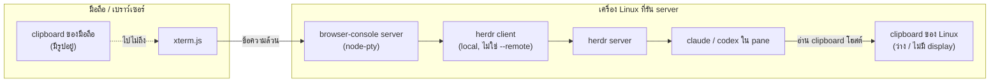
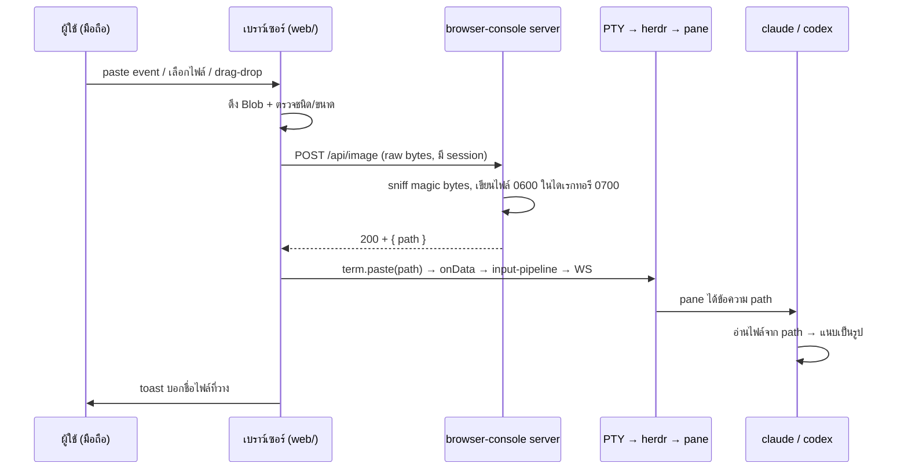

# แผน: รองรับการวางรูปเข้า Claude Code / Codex ผ่าน browser terminal (ใน herdr)

วันที่ 2026-08-25 · plan · **ทำเสร็จแล้ว**

> **สถานะ:** Phase 0–4 เสร็จ · สิ่งที่ยังค้างอยู่ใน `TODO.md` คือเรื่องที่ต้องใช้
> **เครื่องจริง** ถึงจะตอบได้ (HEIC บน iPhone, paste event บนมือถือ)
> ไม่ใช่โค้ดที่ยังไม่ได้เขียน

เอกสารวิจัยที่เป็นฐานของแผนนี้: [`docs/research-image-paste.md`](./research-image-paste.md)
— ทุกข้อเท็จจริงเรื่อง CLI/สเปก terminal อยู่ในนั้นพร้อมลิงก์ต้นทาง แผนนี้อ้างถึงโดยไม่ทวนซ้ำ

---

## 1. เป้าหมาย

บนมือถือ (เคสหลักของโปรเจกต์นี้) ผู้ใช้ต้องแนบรูป — สกรีนช็อต, ภาพถ่าย, รูปจากแกลเลอรี —
เข้าไปให้ agent ที่รันอยู่ใน pane ของ herdr ได้ ทั้ง `claude` และ `codex`
โดยไม่ต้องออกจากเบราว์เซอร์ไปทำอย่างอื่นก่อน

**นอกขอบเขต:** การ *แสดง* รูปในเทอร์มินัล (kitty graphics / sixel), การวางรูปเข้า
TUI อื่นที่ไม่ใช่ agent CLI, การซิงก์ clipboard สองทางแบบทั่วไป

---

## 2. สถานะปัจจุบัน — ทำไมวันนี้กดวางแล้วเงียบ

หลักฐานจากซอร์สจริงของ herdr (repo อยู่ที่ `~/development/herdr`) และของ repo นี้:

พังสองจุดพร้อมกัน ไม่ใช่จุดเดียว:

1. **bridge ของ herdr ปิดอยู่ในโหมดนี้** — `should_bridge_clipboard_image_paste()`
   (`src/client/mod.rs:1794`) จะทำงานก็ต่อเมื่อ `is_remote_client_process()` เป็นจริง
   ซึ่งเช็ค env `HERDR_REMOTE_KEYBINDINGS` (`src/client/mod.rs:661`) ที่ตั้งโดย
   `herdr --remote` เท่านั้น · CHANGELOG #986 ระบุว่า *จงใจ* ปิดสำหรับ local client
   (เพื่อไม่ให้ `Ctrl+V` ใน Vim โดนกิน) · repo นี้ spawn `herdr` เปล่าๆ
   (`server/config.ts:131` — `SHELL_CMD` ดีฟอลต์ `herdr`) จึงเป็น local client เสมอ
2. **ต่อให้เปิดได้ก็อ่านผิดเครื่อง** — `platform::read_clipboard_image()` อ่าน clipboard
   ของ **เครื่องที่รัน client** ซึ่งคือ Linux host ไม่ใช่มือถือ · และ agent CLI เองก็
   อ่าน clipboard ของโฮสต์เหมือนกัน

และตามงานวิจัย §0/§3: **ไม่มีกลไกมาตรฐานใดที่ส่ง image bytes ผ่าน PTY ได้เลย**
(bracketed paste = ข้อความล้วน, OSC 52 = `text/plain`, kitty graphics = output ทางเดียว)
ข้อยกเว้นเดียวคือ kitty OSC 5522 ซึ่งไม่มี CLI ตัวไหนรองรับ

> **ผลลัพธ์:** ไม่มีทาง "ทำให้ paste ทำงาน" ด้วยการปรับ escape sequence ฝั่ง xterm
> browser-console ต้องรับบทเป็น bridge เอง แบบเดียวกับที่ `herdr --remote` เป็น

---

## 3. สถาปัตยกรรมที่เลือก

**browser-console กลายเป็น image-paste bridge ของตัวเอง**: รับ bytes ที่เบราว์เซอร์ →
ส่งขึ้น server → เขียนเป็นไฟล์ที่ agent อ่านได้ → server ตอบ **path** กลับมา →
**เบราว์เซอร์วาง path นั้นผ่าน `term.paste()`** ซึ่งเป็นเส้นทาง input เดิมที่มีอยู่แล้ว

> **การฉีดต้องเกิดฝั่งเบราว์เซอร์ ไม่ใช่ฝั่ง server** — นี่คือข้อที่ตัดสินใจใหม่หลัง
> scrutinize รอบ 1 เหตุผลอยู่ใน §5.5

จุดสำคัญ: **เราไม่แตะ herdr เลย** herdr มองว่านี่คือข้อความที่พิมพ์เข้ามาปกติ
ซึ่งเป็นพฤติกรรมเดียวกับที่ herdr เองสร้างขึ้นตอน bridge (`terminal_attach.rs:1`
`paste_payload_for_runtime()` ยิง path เป็น text เข้า pane)

### ทางเลือกที่พิจารณาแล้วตัดทิ้ง

| ทางเลือก | ทำไมตัด |
|---|---|
| ตั้ง `HERDR_REMOTE_KEYBINDINGS` เพื่อปลุก bridge ของ herdr | bridge อ่าน clipboard ของ Linux host ไม่ใช่ของมือถือ — แก้ไม่ตรงจุด และไปกิน `Ctrl+V` ของ pane app ด้วย |
| ให้ server เขียนรูปลง clipboard ของ Linux (`wl-copy`/`xclip`) แล้วส่งสัญญาณ paste | host เป็น headless ไม่มี display server; เปราะและเพิ่ม dependency ระบบ |
| ใช้ kitty OSC 5522 ผ่าน PTY | ไม่มีหลักฐานว่า CLI ตัวไหนรองรับ (วิจัย §3) — เท่ากับเขียนของที่ไม่มีใครอ่าน |
| ส่ง PR เข้า herdr ให้มีคำสั่ง `herdr pane paste-image <pane> <file>` | เป็นทางที่สะอาดกว่าในระยะยาว แต่ไม่ใช่ทางที่ต้องรอ — ทำเป็น follow-up ได้ (ดู §9) |

---

## 4. งานฝั่งเบราว์เซอร์ (`web/`)

### 4.1 ทางเข้าของรูป — สามทาง เรียงตามความน่าเชื่อถือบนมือถือ

1. **ปุ่มแนบไฟล์ + `<input type="file" accept="image/*">` (ทางหลัก)**
   วิจัย §5 ระบุว่า `ClipboardEvent` บน iOS Safari / Android Chrome **ยังยืนยันไม่ได้**
   ส่วน file input เป็นของที่ทำงานแน่นอนทุกที่ และบนมือถือจะเปิดทั้ง "ถ่ายรูป" และ
   "เลือกจากคลัง" ให้เอง — จึงต้องเป็น path ที่รับประกัน ไม่ใช่ fallback
2. **`paste` event (เดสก์ท็อป และมือถือถ้าได้)**
   อ่าน `ClipboardEvent.clipboardData.items` หาชนิด `image/*`
   **กับดัก:** xterm.js `handlePasteEvent` อ่านแค่ `text/plain` แล้วเรียก
   `stopPropagation()` → ต้องผูก listener ที่ **capture phase** บน element ที่ครอบ
   textarea ซ่อนของ xterm ไม่ใช่ bubble phase
3. **drag & drop** (เดสก์ท็อป) — `dragover`/`drop` อ่าน `DataTransfer.files`

ทั้งสามทางลงมาที่ฟังก์ชันเดียวกัน: `attachImage(blob)`

### 4.2 UI

- ปุ่มใน keybar (ตามสัญญาการโต้ตอบใน `README.md` — ต้องเป็นปุ่มชัดเจน ไม่ใช่ gesture ซ่อน)
  พร้อม glyph ที่วาดด้วยกติกาเดียวกับปุ่มอื่นใน `web/keybar.ts`
  และค่าคงที่ layout ต้องซิงก์กับ `web/style.css` ตาม AGENTS.md
- ระหว่างอัปโหลดแสดงสถานะ; สำเร็จแสดง toast บอกชื่อไฟล์ที่ถูกวาง
- **ล้มเหลวอย่างซื่อสัตย์** ตามแนวของ `web/clipboard.ts`: แยก `unsupported` /
  `denied` / `too-large` / `failed` เพราะข้อความที่ควรบอกผู้ใช้ต่างกัน
  โดยเฉพาะ "รูปใหญ่เกิน" ที่ผู้ใช้แก้เองได้

### 4.3 HEIC — กับดักที่ใหญ่ที่สุดของ "มือถือ"

`<input type="file" accept="image/*">` บน iPhone จะยื่นรูปจากคลังมาให้ และรูปพวกนั้น
**เป็น HEIC/HEIF โดยดีฟอลต์มาตั้งแต่ iOS 11** ปลายทางไม่รองรับทั้งคู่:

- **Claude Code** — เอกสารทางการระบุรูปแบบที่รองรับไว้ชัด (JPEG/PNG/GIF/WebP)
  ไม่มี HEIC (ดูงานวิจัย §1)
- **Codex** — ใช้ crate `image` ผ่าน `image_dimensions()` ซึ่งไม่รองรับ HEIC
  → `attach_image` ไม่เกิด และตามงานวิจัย §2 มัน **ล้มเหลวเงียบ**

ถ้าไม่จัดการ ฟีเจอร์นี้จะ "ใช้ไม่ได้บน iPhone" ซึ่งคือผู้ใช้หลักทั้งหมดของโปรเจกต์

**ทางแก้ เรียงตามลำดับที่ควรลอง:**

1. ระบุ `accept="image/png,image/jpeg,image/gif,image/webp"` แทน `image/*` —
   มีรายงานว่า iOS แปลง HEIC เป็น JPEG ให้เองเมื่อ accept list ไม่มี HEIC
   **ต้องทดสอบจริงบนเครื่อง ไม่ใช่เชื่อตามนี้** (เพิ่มเข้า Phase 0)
2. ถ้าข้อ 1 ไม่จริง: re-encode ฝั่งเบราว์เซอร์ผ่าน `createImageBitmap()` +
   `OffscreenCanvas.convertToBlob({ type: 'image/png' })` — Safari ถอดรหัส HEIC ได้
   เพราะ OS รองรับ จึงแปลงได้แม้ JS ไม่รู้จักฟอร์แมต
3. ตรวจ magic bytes ฝั่ง server แล้ว **ปฏิเสธพร้อมข้อความที่บอกเหตุผล** เป็นตาข่ายสุดท้าย —
   ล้มเหลวแบบเห็นได้ ดีกว่าปล่อยให้ agent เงียบ

ข้อ 3 ต้องมีเสมอไม่ว่าข้อ 1/2 จะสำเร็จหรือไม่ · นี่คือเหตุผลที่การ sniff magic bytes
ใน §5.2 ไม่ใช่แค่เรื่องความปลอดภัย แต่เป็นเรื่อง UX

### 4.4 CSP บล็อก `blob:` — ถ้าจะโชว์ตัวอย่างรูป

`SECURITY_HEADERS` ตั้ง `img-src 'self' data:` ไว้ (`server/index.ts:89`) **ไม่มี `blob:`**
ถ้าโชว์ thumbnail ด้วย `URL.createObjectURL(blob)` มันจะถูกบล็อกเงียบๆ เห็นแค่รูปแตก

สามทางเลือก เรียงตามที่ชอบ:

1. **ไม่โชว์ตัวอย่าง** — แค่ toast บอกชื่อไฟล์ก็พอ ไม่ต้องแตะ CSP (เฟสแรกเอาแบบนี้)
2. `FileReader.readAsDataURL` → `data:` ซึ่ง CSP อนุญาตอยู่แล้ว แต่กินหน่วยความจำ
   เท่าขนาดรูป × 1.33 บนมือถือ
3. เพิ่ม `blob:` เข้า `img-src` — ต้องเขียนเหตุผลกำกับใน `server/index.ts`
   เหมือน directive อื่นๆ และอัปเดต `server/index.test.ts`

### 4.5 สิ่งที่ต้องไม่ทำ

- **ห้ามส่ง empty bracketed paste** (`\x1b[200~\x1b[201~`) — นั่นคือสัญญาณ
  image-paste ของ herdr remote client โดยเฉพาะ การส่งมั่วอาจไปชนพฤติกรรมนั้นในอนาคต
- ห้าม resize/recompress รูปฝั่งเบราว์เซอร์โดยอัตโนมัติในเฟสแรก — เปลี่ยนสิ่งที่ผู้ใช้ตั้งใจส่ง
  (จะพิจารณาเป็น opt-in ทีหลัง ดู §9)

---

## 5. งานฝั่ง server (`server/`)

### 5.1 ช่องทางขนส่ง — เลือก HTTP POST

`server/pty.ts` วันนี้ตีความ **binary frame = raw PTY input** ตรงๆ และ
**text frame = control JSON** การยัดรูปลง WebSocket จึงต้องเลือกอย่างใดอย่างหนึ่ง:
เปลี่ยน framing ของ binary (breaking) หรือ base64 ใส่ JSON (บวม 33% + ต้องแบ่ง chunk เอง)

เพิ่มเติม: WS ขาเข้าถูกจำกัดไว้ที่ **`MAX_INBOUND_PAYLOAD = 256 KiB`**
(`server/index.ts:215`) ซึ่งตั้งไว้จงใจเพราะ `perMessageDeflate` ทำให้เพดานนี้บังคับ
**หลังคลายบีบอัด** — ปลดเพดานเพื่อขนรูปคือเปิดช่อง decompression amplification
ที่คอมเมนต์ตรงนั้นอธิบายไว้ว่ากันอยู่

จะแบ่ง chunk ให้ต่ำกว่า 256 KiB ก็ทำได้จริง เพดานนี้จึงไม่ใช่เหตุผลชี้ขาด
**เหตุผลชี้ขาดคือ state**: chunking ต้องมี buffer ค้างฝั่ง server + จัดการลำดับ +
timeout ของ upload ที่ค้างครึ่งทาง + กติกาว่าจะเกิดอะไรถ้า WS ถูก `superseded`
กลางคัน — ทั้งหมดนี้ HTTP request เดียวได้มาฟรีจาก TCP อยู่แล้ว

จึงเสนอ **`POST /api/image`** ที่ `server/index.ts` แทน:

- เข้ากับ endpoint เดิม (`/api/login`, `/api/logout`, `/api/session`) ทั้งรูปแบบและ auth
- ได้ streaming + size limit + content-type ฟรี ไม่ต้อง base64
- ไม่แตะ framing ของ WS ที่มี backpressure logic ละเอียดอยู่แล้ว (`server/outbound.ts`)

**ห้ามใช้ `readJsonBody()` ซ้ำ** — มันเพดาน `MAX_BODY_BYTES` (4 KiB) และ
`JSON.parse` ทั้งก้อน ต้องเขียน reader ใหม่ที่สตรีมลงไฟล์โดยตรง แต่ **ต้องรักษา
พฤติกรรม `req.destroy()` ก่อน throw** ตามเหตุผลที่คอมเมนต์เหนือ `readJsonBody`
(`server/index.ts:30`) อธิบายไว้ ไม่งั้นเป็นช่องกิน fd · body เป็น raw bytes
(`Content-Type: image/png` ฯลฯ) ไม่ใช่ multipart — ไม่ต้องพึ่ง parser ภายนอก

**เงื่อนไขความปลอดภัยของ endpoint นี้ (ต่างจาก `/api/login` โดยตั้งใจ):**

- ต้องมี session ที่ใช้ได้ (`sessionValid`) — ไม่มี = 401
- ต้องผ่าน `originAllowed()` **แบบเข้ม** ไม่ใช่ `loginOriginAllowed()` ที่ยอม
  `Origin` ว่างเพื่อรองรับ curl — endpoint นี้มีแต่เบราว์เซอร์เรียก จึงต้องมี `Origin` เสมอ
- เพดานขนาด **16 MiB** (ใช้ตัวเลขเดียวกับ `MAX_CLIPBOARD_IMAGE_PAYLOAD` ของ herdr,
  `src/protocol/wire.rs:28`) — ตัดการเชื่อมต่อทันทีเมื่อเกิน ไม่บัฟเฟอร์ต่อ
- rate limit: **ห้ามใช้ instance เดียวกับ login** · `createLoginLimiter()` มี `globalMax`
  ที่บล็อก *ทุก* IP เมื่อยอดรวมถึงเพดาน (`server/ratelimit.ts:38`) — ยิงอัปโหลดรัวๆ
  จะทำให้เจ้าของล็อกอินไม่ได้ ซึ่งเป็นบั๊กคลาสเดียวกับที่คอมเมนต์ `/api/login`
  (`server/index.ts:151`) เตือนไว้ · ถ้าจะใช้ ต้องสร้าง instance แยกของตัวเอง
- **เพดานพื้นที่รวม** ไม่ใช่แค่เพดานต่อไฟล์ — TTL 24 ชม. + 16 MiB ต่อครั้ง ยังกองได้
  หลาย GB ก่อนถูกกวาด · ตอน stage ให้รวมขนาดในไดเรกทอรีก่อน แล้วลบไฟล์เก่าสุดทิ้ง
  จนต่ำกว่าเพดาน (เช่น 256 MiB) ก่อนเขียนไฟล์ใหม่

### 5.2 การ stage ไฟล์ — ลอกของที่ herdr พิสูจน์แล้ว

`~/development/herdr/src/server/clipboard_image.rs` มีรายละเอียดที่คิดมาแล้ว ควรลอกทั้งชุด:

| เรื่อง | ทำตาม |
|---|---|
| ไดเรกทอรี | สร้างเอง สิทธิ์ `0700`, ผูกกับ uid ในชื่อ |
| ไฟล์ | `O_CREAT\|O_EXCL` สิทธิ์ `0600` |
| ชื่อไฟล์ | **ห้ามมีช่องว่าง** (สำคัญมาก — ดู §6) รูปแบบ `paste-<ts>-<rand>.<ext>` |
| นามสกุล | **มาจากผลการ sniff magic bytes เท่านั้น** ไม่ใช่จากชื่อไฟล์หรือ `Content-Type` ที่ client ส่งมา · whitelist `png/jpg/gif/webp` · ไม่เข้าพวก = ปฏิเสธ ไม่ใช่เดาเป็น `png` |
| TTL | ลบไฟล์เก่าเกิน 24 ชม. ทุกครั้งที่ stage |
| ตรวจชนิด | **sniff magic bytes** ไม่เชื่อ `Content-Type` ที่ client ส่งมา (herdr Linux ก็ validate ก่อนรับ — CHANGELOG #534) |
| cleanup ราย session | **ห้ามลอกข้อนี้** — ดู §5.4 |

### 5.3 ไฟล์ควรอยู่ไหน — **ใช้ `$HOME` ไม่ใช่ `$TMPDIR`**

รอบแรกทิ้งข้อนี้ไว้เป็น "ต้องตัดสินใจ" · ตรวจ deployment จริงแล้วมันตัดสินได้เลย

process ที่ *เขียน* ไฟล์กับ process ที่ *อ่าน* ไฟล์ **อยู่คนละ unit กัน**:

- ผู้เขียน: `browser-console.service` (`WorkingDirectory=%h/development/browser-console`)
- ผู้อ่าน: pane ที่เป็นลูกของ `herdr-server.service` (`WorkingDirectory=%h`,
  `KillMode=control-group`) — ไม่ใช่ลูกของ browser-console
  (README อธิบายไว้ในหัวข้อ "ทำไมต้องแยก herdr ออกเป็น unit ของตัวเอง")

วันนี้ทั้งสอง unit ไม่ได้ตั้ง `PrivateTmp=` จึงเห็น `/tmp` เดียวกัน — **แต่นั่นคือ
สมมติฐานที่ไม่มีใครเขียนไว้ว่าห้ามเปลี่ยน** ใครก็ตามที่มา hardening แล้วเติม
`PrivateTmp=yes` ให้ unit ใดหน่วยหนึ่ง (ซึ่งเป็นคำแนะนำมาตรฐาน) จะทำให้ฟีเจอร์นี้พัง
แบบหาสาเหตุยากมาก: อัปโหลดสำเร็จ path โผล่ที่ prompt แต่ agent บอกว่าไม่มีไฟล์

`$HOME` ไม่มีปัญหานั้น ทั้งสอง unit เป็น user service ของผู้ใช้เดียวกันและอ้าง `%h`
ตรงๆ อยู่แล้ว

**เลือก: `$HOME/.cache/browser-console/images/`** (สิทธิ์ 0700)
ข้อดีรอง: มีโอกาสอยู่ในขอบเขตที่ sandbox ของ agent ยอมให้อ่านมากกว่า `/tmp`

Phase 0 ยังต้องทดสอบทั้งสองที่อยู่ดี เพื่อยืนยันเรื่อง sandbox — แต่ค่าดีฟอลต์
ที่จะเขียนลงโค้ดคือ `$HOME` และเหตุผลข้างบนต้องอยู่ในคอมเมนต์

> **Docker:** ในภาพจาก `Dockerfile` ทั้ง server และ shell อยู่ในคอนเทนเนอร์เดียวกัน
> จึงเห็นไฟล์ระบบเดียวกันเสมอ ไม่มีปัญหานี้ · ข้อควรระวังคือกฎเดียวกัน —
> **staging dir ต้องอยู่ใน mount namespace เดียวกับ process ที่รัน agent**

### 5.4 อายุไฟล์ — TTL อย่างเดียว ห้ามลบตอน WS ปิด

herdr เก็บ `staged_clipboard_files` ต่อ client แล้วลบตอน client disconnect
(`src/server/headless.rs:1418`) ซึ่งถูกสำหรับ herdr เพราะ client ของมันคือ
desktop attach ที่อยู่ยาว **แต่ลอกมาตรงๆ ที่นี่จะกลายเป็นบั๊ก**:

- ทุกครั้งที่ WS ต่อใหม่ ตัวเก่าจะถูกปิดด้วย `4000 'superseded'` (`server/index.ts:238`)
- เบราว์เซอร์มือถือหลุด WS ทุกครั้งที่สลับแอป/ล็อกจอ
- ส่วน agent ยังรันอยู่ใน pane ของ herdr ข้ามการหลุดนั้นได้สบาย และอาจยังไม่ได้
  กด Enter ส่ง prompt ที่มี path นั้นอยู่ด้วยซ้ำ

→ ลบไฟล์ที่ agent กำลังจะอ่าน ระหว่างที่ผู้ใช้แค่สลับไปเปิดแอปกล้อง

**กติกา:** อายุไฟล์ผูกกับเวลาอย่างเดียว (TTL 24 ชม. เท่า herdr) กวาดตอน stage ครั้งถัดไป
ไม่ผูกกับ lifecycle ของ WebSocket

### 5.5 การฉีด path — **ฝั่งเบราว์เซอร์ ไม่ใช่ฝั่ง server**

รอบแรกของแผนนี้ให้ server เขียน path ลง PTY เอง ซึ่งผิดด้วยเหตุผลสามข้อที่ตรวจจากซอร์สจริง:

1. **ไม่มีทางเขียนอยู่แล้ว** — `attachPty()` (`server/pty.ts:26`) คืนแค่ `{ pid }`
   ตัว `term` ไม่ถูกส่งออกไปไหน การให้ HTTP layer เขียนเข้า PTY ต้องเดินสายใหม่ทั้งเส้น
   และต้องผูก request กับตัวแปร `active` (`server/index.ts:236`) ซึ่งเป็น state ที่
   HTTP handler ไม่ควรรู้จัก
2. **ขัดกับกติกาที่ repo ตั้งไว้ชัดเจน** — คอมเมนต์เหนือ `doPaste()` (`web/main.ts:681`)
   เขียนไว้ตรงๆ ว่าใช้ `term.paste()` โดยตั้งใจ *"ไม่มีเส้นทางไบต์ใหม่เกิดขึ้น"*
   และ AGENTS.md ห้าม `addon-attach` ด้วยเหตุผลเดียวกัน — input ต้องผ่าน
   `web/input-pipeline.ts` เส้นเดียว
3. **มันตอบคำถาม bracketed paste ให้ฟรี** — `term.paste()` ห่อด้วย `\x1b[200~…\x1b[201~`
   ให้เองเฉพาะเมื่อแอปข้างในเปิด mode 2004 ซึ่งเป็น logic เดียวกับที่
   `paste_payload_for_runtime()` ของ herdr ทำ (`src/server/terminal_attach.rs:1`)
   เราจึงไม่ต้องเดา ไม่ต้องทดสอบสองแบบ

**ดังนั้น:** `POST /api/image` ตอบ `{ path }` กลับมา แล้วเบราว์เซอร์เรียก
`t.paste(path)` ผ่านโค้ดเส้นเดียวกับ `doPaste()`

- **path เปล่าล้วน** ไม่มี newline ไม่มีช่องว่างต่อท้าย — Phase 0 ทดสอบรูปแบบนี้
  ผ่านทั้ง Claude Code และ Codex
- ยกเลิกโหมดเลือกข้อความก่อน เหมือนที่ `doPaste()` ทำ

**ตรวจแล้วว่าไม่ชนกับ sticky modifier**: `classify()` จัดข้อความหลายตัวอักษรเป็น
`kind: 'paste'` และ `feed()` เรียก `consumeArmed()` แล้ว `sendText(data)` ตรงๆ
โดยไม่แปลง ctrl/alt/shift (`web/input-pipeline.ts:117`) — path จึงไม่ถูกทำให้เพี้ยน
แม้ผู้ใช้จะ arm modifier ค้างไว้
- ผลพลอยได้: endpoint ไม่ต้องรู้ว่ามี PTY session อยู่หรือไม่

**แต่ต้องเช็ค WS เอง** — `send` ใน `web/main.ts:142` ทิ้งไบต์เงียบๆ เมื่อ socket
ไม่ได้ `OPEN` ผู้ใช้จะเห็นแค่ "อัปโหลดสำเร็จ" แล้วไม่มีอะไรโผล่ที่ prompt
ซึ่งบนมือถือที่ WS หลุดบ่อยจะเจอบ่อยด้วย → ก่อนเรียก `t.paste()` ต้องเช็คสถานะ
แล้วแจ้ง "ยังไม่ได้เชื่อมต่อ — ลองใหม่" · ไฟล์ที่ stage ไว้แล้วไม่ต้องลบ
ผู้ใช้กดวางซ้ำได้เมื่อกลับมาต่อ

### 5.6 herdr อาจไม่ได้อยู่ในโหมดพิมพ์

path ที่วางเข้าไปคือ "ข้อความที่ผู้ใช้พิมพ์" ในสายตา herdr ถ้าตอนนั้น herdr อยู่ใน
copy mode, navigate mode หรือ modal อะไรสักอย่าง ตัวอักษรของ path จะถูกตีความเป็น
คำสั่ง ไม่ใช่ข้อความที่ไหลไป pane

เรามองไม่เห็น state นั้นจากฝั่งเบราว์เซอร์ และไม่ควรพยายามเดา — ทางที่ซื่อสัตย์คือ
**ยอมรับและบอกผู้ใช้**: toast หลังวางสำเร็จให้แสดง path ที่วางไป เพื่อให้ผู้ใช้เห็นเองว่า
มันไปโผล่ที่ prompt จริงหรือไม่ · Phase 0 ต้องทดสอบเคส copy mode ด้วยเพื่อรู้ว่าเสียหายแค่ไหน

**มีทางเลี่ยงที่สะอาดกว่า แต่ไม่เอาในเฟสแรก:** herdr มีคำสั่ง
`herdr pane send-text <pane_id> <text>` (`src/cli/pane.rs:907`) ที่คุยผ่าน unix socket
ตรงเข้า pane — ข้ามทั้ง PTY และโหมดของ herdr ไปเลย จึงไม่มีปัญหานี้
**เหตุผลที่ยังไม่ใช้:** `SHELL_CMD` เป็นค่าที่ผู้ใช้เปลี่ยนได้ (README รองรับ
`tmux new -A -s web` และ `bash` ด้วย) การผูกฟีเจอร์นี้กับ herdr จะทำให้มันพัง
เงียบๆ สำหรับคนที่ไม่ได้ใช้ herdr · เก็บไว้เป็น optimization ที่ตรวจ `SHELL_CMD` ก่อน
ดู §9

---

## 6. รูปแบบ path ที่แต่ละ CLI ต้องการ

| CLI | หลักฐาน | สิ่งที่ต้องระวัง |
|---|---|---|
| **Codex** | `codex-rs/tui/src/chat_composer.rs:1180-1224` (ค้นเมื่อ 2026-08-25) — วาง path เป็นข้อความ → `normalize_pasted_path` → `image::image_dimensions` → `attach_image` | ใช้ `shlex` แยกคำ → **path ที่มีช่องว่างและไม่ครอบ quote จะถูกหั่นแล้วทิ้งเงียบ** → กติกา "ชื่อไฟล์ห้ามมีช่องว่าง" ใน §5.2 คือสิ่งที่กันเคสนี้ |
| **Claude Code** | ปิดซอร์ส · หลักฐานทางอ้อมแข็ง: herdr CHANGELOG #205 ระบุตรงว่าออกแบบ staging+paste path นี้ "so Claude Code image paste works" | **ยังไม่มีหลักฐานระดับซอร์ส** ว่ารับ path เปล่าที่ถูก paste → เป็นความเสี่ยงอันดับหนึ่งของแผน |

> **หมายเหตุเรื่องหลักฐาน:** เลขบรรทัดของ Codex มาจากการค้น repo ตอน 2026-08-25
> และผมยังไม่ได้ตรวจซ้ำกับ commit ที่ปักหมุด · repo นั้นเคลื่อนเร็ว ให้ยึด **ชื่อฟังก์ชัน**
> (`normalize_pasted_path`, `attach_image`) เป็นหลัก ไม่ใช่เลขบรรทัด
> ส่วนข้อความในตารางนี้ทั้งหมดมาจาก `docs/research-image-paste.md` ซึ่งมีลิงก์ต้นทางกำกับ

ถ้า Phase 0 พบว่า Claude Code ต้องการรูปแบบอื่น (เช่น `@path`) ให้ทำเป็น
**ตัวเลือกรูปแบบการฉีดที่ตั้งค่าได้** แทนการเดา — และห้ามใส่ `@` แบบมั่ว
เพราะ `@` ของ Claude Code เป็น file reference คนละความหมายกับการแนบรูป

---

## 7. Phase 0 — **ทำแล้ว** (2026-08-25)

ทดสอบจริงในเครื่องนี้ผ่าน `herdr pane send-text` ยิงไบต์เข้า pane ตรงๆ
(`send-text` ส่ง raw bytes ไม่ห่ออะไรให้ — `src/app/api/panes.rs:1419`
จึงจำลองได้ทั้ง "พิมพ์" และ "วาง")

| ที่ทดสอบ | ผล |
|---|---|
| Claude Code — **พิมพ์** path เปล่า (ไม่มี bracket) | ❌ ขึ้นเป็นข้อความธรรมดา ไม่แนบรูป |
| Claude Code — **วาง** `\x1b[200~<path>\x1b[201~` | ✅ `[Image #1]` |
| Codex — วาง bracketed paste | ✅ `[Image #1]` |
| path ใน `$HOME/.cache/…` | ✅ ทั้งสองตัว |
| path ใน `/tmp/…` | ✅ ทั้งสองตัว — **sandbox ไม่ใช่ปัญหา** |
| มีช่องว่างต่อท้าย path **ในก้อน paste** | ✅ Codex ยังแนบได้ (ยังไม่ทดสอบกับ Claude Code) |

### สิ่งที่ผลนี้เปลี่ยน

1. **ยืนยันความเสี่ยงอันดับหนึ่งว่าไม่มีแล้ว** — Claude Code แนบรูปจาก path
   ที่ถูก paste ได้จริง ไม่ต้องใช้ `@` ไม่ต้อง quote
2. **bracketed paste ไม่ใช่ "ทางเลือก" แต่เป็นเงื่อนไขบังคับ** — path ที่ถูก
   *พิมพ์* เข้าไปเฉยๆ ไม่ทำงาน · นี่คือเหตุผลเพิ่มอีกข้อที่ต้องใช้ `term.paste()`
   ซึ่งห่อ bracket ให้ตามโหมด 2004 แทนการส่งไบต์เอง (§5.5)
3. **§5.3 ที่เลือก `$HOME` เพราะกลัว sandbox — เหตุผลนั้นตกไป** แต่ข้อสรุป
   ยังเหมือนเดิม เพราะเหตุผลที่แท้จริงคือเรื่อง `PrivateTmp=` ระหว่างสอง systemd unit
   ซึ่งไม่เกี่ยวกับ sandbox ของ agent เลย
4. **ห้ามใส่ช่องว่างต่อท้ายในก้อน paste** — ทดสอบผ่านเฉพาะ Codex
   ส่วนที่ทดสอบผ่านทั้งคู่คือ path เปล่าๆ ล้วน · จะพิมพ์ต่อได้ผู้ใช้กด space เอง

### ที่ยังไม่ได้ทดสอบ

- **HEIC จาก iPhone จริง** (§4.3) — ยังเป็นความเสี่ยงอันดับหนึ่งที่เหลืออยู่
  ต้องเปิดหน้าเว็บบนเครื่องจริงถึงจะรู้
- herdr ขณะอยู่ใน copy mode (§5.6)
- agent อ่านไฟล์ตอนไหน — แต่ไม่สำคัญแล้วเพราะเลิกลบไฟล์ตอน WS ปิด (§5.4)

## 8. เฟสการทำงาน

| เฟส | ขอบเขต | เสร็จเมื่อ |
|---|---|---|
| ~~**0. spike**~~ | ~~ยืนยันสมมติฐาน §7~~ | ✅ ดู §7 |
| ~~**1. server**~~ | `server/image-staging.ts` + `POST /api/image` + กวาดตาม TTL/โควตา | ✅ ทดสอบ E2E ด้วย curl จริงครบทั้ง 200/401/403/413/415 |
| ~~**2. ทางเข้าหลัก**~~ | ปุ่ม `▣` + file input + ข้อความ error แยกตามเหตุผล | ✅ `web/image-attach.ts` — **ยังไม่ได้ลองบนมือถือจริง** |
| **3. ทางเข้าเสริม** | paste event (capture phase) ✅ · drag & drop ยังไม่ทำ | paste ทำแล้ว · drag-drop ย้ายไป `TODO.md` |
| ~~**4. เอกสาร**~~ | README, `.env.example`, `TODO.md`, §4.5 ของเอกสาร deployment security | ✅ |

ทุกเฟสรัน `pnpm test` และ `pnpm build` ก่อนถือว่าเสร็จ ตาม AGENTS.md
และทำงานบน worktree แยกที่แตกจาก `origin/main` ตอนเริ่มเฟส 1

---

### 8.1 ปิดได้ด้วย config

`POST /api/image` เป็นผิวใหม่ที่รับ body ใหญ่และเขียนไฟล์ · เพิ่มค่าใน
`server/config.ts` (แนวเดียวกับ `SHELL_CMD`) ให้ปิดได้โดยไม่ต้อง build ใหม่ —
ปิดแล้ว endpoint ต้องตอบ 404 ไม่ใช่ 403 เพื่อไม่ประกาศว่ามีอยู่
ค่าดีฟอลต์ **เปิด** เพราะเป็นเหตุผลทั้งหมดของงานนี้

### 8.2 บันทึกลง TODO.md

รายการใน §9 ต้องไปอยู่ใน `TODO.md` ตามที่ AGENTS.md กำหนดว่างานที่เลื่อนไว้อยู่ที่นั่น
ไม่ใช่ค้างอยู่ในเอกสารแผนที่ไม่มีใครเปิดอีก

---

## 9. Follow-up ที่ไม่อยู่ในเฟสแรก

- **เส้นทางเฉพาะเมื่อ `SHELL_CMD=herdr`**: ใช้ `herdr pane send-text` แทนการ
  `term.paste()` เพื่อกำจัดปัญหาโหมด/โฟกัสใน §5.6 · ต้องแก้ก่อนว่าจะหา pane
  ที่โฟกัสอยู่จากนอก pane ได้ยังไง (`herdr pane list` มีธง focused แต่ยังไม่ได้ยืนยันว่า
  เรียกจาก process ที่ไม่ได้อยู่ใน pane แล้วเชื่อถือได้)
- **PR เข้า herdr**: คำสั่ง `herdr pane paste-image <pane-id> <file>` จะรวมทั้ง
  staging และการฉีดไว้ที่เดียว และให้ herdr เป็นเจ้าของ lifecycle ของไฟล์ —
  สะอาดกว่าในระยะยาว
- **บีบอัด/ย่อรูปแบบ opt-in** สำหรับเน็ตมือถือช้า
- **หลายรูปในครั้งเดียว**
- ตรวจว่าเทอร์มินัลที่ผู้ใช้ใช้อยู่รองรับการ *แสดง* รูปหรือไม่ (คนละเรื่องกับแผนนี้)

---

## 10. ความเสี่ยงที่ยังเปิดอยู่

| ความเสี่ยง | ผลกระทบ | จัดการ |
|---|---|---|
| Claude Code ไม่รับ path เปล่าที่ paste | ดีไซน์หลักพัง | **Phase 0 ก่อนเขียนโค้ด** |
| sandbox ของ agent อ่าน `$TMPDIR` ไม่ได้ | แนบไม่ติด เงียบๆ | ทดสอบสองที่เก็บใน Phase 0 |
| iPhone ยื่นไฟล์ HEIC มา | agent เมินรูปแบบเงียบๆ = ฟีเจอร์ใช้ไม่ได้บนเครื่องหลัก | Phase 0 ข้อ 0 + sniff แล้วปฏิเสธพร้อมเหตุผล (§4.3) |
| `ClipboardEvent` ใช้ไม่ได้บน iOS/Android | paste ไม่ทำงานบนมือถือ | file input เป็นทางหลัก ไม่ใช่ fallback |
| xterm กิน paste event ก่อน | listener ไม่ถูกเรียก | ผูกที่ capture phase |
| ไฟล์รูปค้างในเครื่อง | กินดิสก์ | 0600 + TTL 24 ชม. (**ไม่ผูกกับ WS** — §5.4) |
| endpoint อัปโหลดถูกยิงรัวจนดิสก์เต็ม | server ล่ม | cap 16 MiB + rate limit ต่อ session |

**สิ่งที่ *ไม่ใช่* ความเสี่ยงใหม่:** "ผู้ใช้ที่ล็อกอินแล้วเขียนไฟล์ลงโฮสต์ได้" — แอปนี้
ให้ shell ของเครื่องอยู่แล้ว การเขียนไฟล์จึงไม่ใช่การยกระดับสิทธิ์ · ผิวการโจมตีจริงที่
เพิ่มขึ้นมีข้อเดียวคือ **endpoint ใหม่ที่ทำงานก่อนตรวจ session ครบ** ซึ่งกันด้วย
`sessionValid` + `originAllowed` แบบเข้ม (§5.1) และต้องมีเทสต์คลุมทั้งสองกรณี

---

## 11. เทสต์ที่ต้องมี

AGENTS.md บังคับให้เพิ่ม Vitest ที่เจาะจงต่อการเปลี่ยนพฤติกรรม รายการขั้นต่ำ:

**server**

- ชื่อไฟล์ที่ stage ออกมา **ไม่มีช่องว่าง** และนามสกุลอยู่ใน whitelist (นี่คือเทสต์ที่
  กันบั๊ก `shlex` ของ Codex ใน §6 — ต้องมีคอมเมนต์บอกว่าทำไม)
- magic bytes ที่ไม่ใช่รูป → ปฏิเสธ ไม่เขียนไฟล์
- HEIC magic (`ftypheic`/`ftypmif1`) → ปฏิเสธพร้อมเหตุผลที่แยกจาก "ไม่ใช่รูป"
- body เกิน 16 MiB → ตัดการเชื่อมต่อ และ **เรียก `req.destroy()`** (ตามแบบ `body.test.ts`)
- ไม่มี session → 401 · `Origin` ผิดหรือไม่มี → 403 (สองเคสแยกกัน)
- กวาดไฟล์เก่าเกิน TTL แต่ **ไม่ลบไฟล์ใหม่** เมื่อ WS ปิด (เทสต์ที่ยืนยัน §5.4)

**web**

- handler ที่ capture phase ถูกเรียกแม้ xterm จะ `stopPropagation()` ใน bubble phase
- `paste` ที่มีแต่ `text/plain` ต้องตกไปทางเดิม ไม่ถูกกลืน
- path ที่ได้กลับมาถูกส่งเข้า `term.paste()` **เป็น path เปล่าล้วน** ไม่มีช่องว่างท้าย ไม่มี newline
- error แต่ละชนิด (`too-large` / `unsupported-format` / `denied` / `failed`)
  ให้ข้อความต่างกัน ตามแนว `web/clipboard.test.ts`
