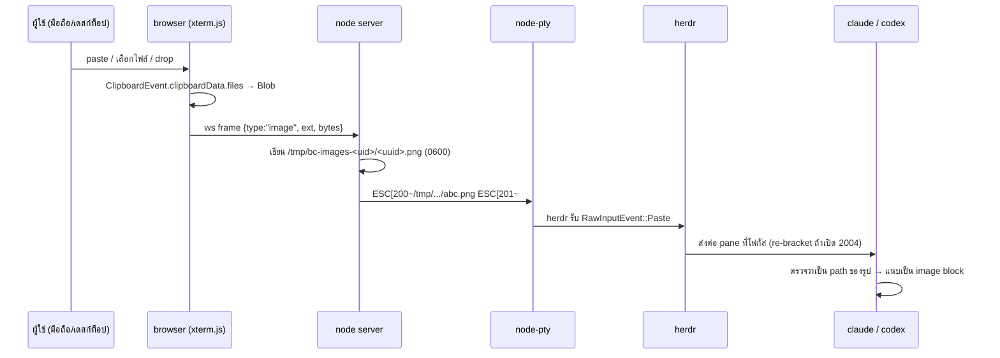

# วางรูปเข้า CLI ผ่าน terminal — มันทำงานยังไงจริงๆ และ browser-console ต้องทำอะไร

วันที่ 2026-08-25 · research · ทุกข้อความที่เป็นข้อเท็จจริงมีลิงก์ต้นทางกำกับ

**คำถาม:** Claude Code CLI และ OpenAI Codex CLI รับรูปภาพเข้าไปได้ยังไงบน macOS /
Windows / Linux — และ browser terminal (xterm.js + node-pty + WebSocket) ที่รัน
`herdr` อยู่ข้างใน จะทำให้ "วางรูป" ใช้งานได้ต้องทำอะไรบ้าง

**สรุปสั้นที่สุด:** รูปภาพ **ไม่เคยวิ่งผ่าน PTY** ทั้งสอง CLI อ่าน clipboard ของ
**เครื่องโฮสต์โดยตรง** (osascript / xclip / wl-paste / PowerShell / arboard) แล้ว
เขียนเป็นไฟล์ชั่วคราว สิ่งที่วิ่งผ่าน PTY มีแค่ **path ที่เป็นข้อความ** ดังนั้นทางเดียวที่
browser terminal จะทำได้คือ **รับ bytes ที่เบราว์เซอร์ → ส่งขึ้น server → เขียนไฟล์ →
พิมพ์ path เข้า PTY** ซึ่งเป็นสถาปัตยกรรมที่ herdr ทำไปแล้วและมีโค้ดให้อ่าน

---

## 0. แกนของเรื่อง — image bytes ไม่เคยอยู่ใน PTY

นี่คือข้อที่ต้องตอบให้ชัดก่อน เพราะมันตัดทางเลือกออกไปเกือบหมด

| กลไก | ทิศทาง | ขนรูปได้ไหม |
|---|---|---|
| Bracketed paste (DEC 2004) | terminal → app | **ไม่ได้ — ข้อความล้วน** |
| OSC 52 | เขียนเป็นหลัก, อ่านได้แต่มักถูกปิด | ไม่ได้ — `text/plain` |
| Kitty graphics protocol | app → terminal | ไม่ได้ (แสดงผลอย่างเดียว) |
| Kitty OSC 5522 | สองทาง, kitty เท่านั้น | **ได้** แต่ไม่มีหลักฐานว่า CLI ตัวไหนใช้ |
| Drag & drop ที่ terminal | terminal → app | ได้เฉพาะ **path เป็นข้อความ** |

รายละเอียดพร้อมสเปกอยู่ใน §3

---

## 1. Claude Code CLI

### 1.1 ทางเข้าของรูป — เอกสารทางการบอกไว้ 3 ทาง

[docs — Work with images](https://code.claude.com/docs/en/common-workflows#work-with-images)
ระบุตรงๆ ว่า:

1. ลาก-วางรูปเข้าไปในหน้าต่าง Claude Code
2. copy รูปแล้ววางด้วย `Ctrl+V` หรือ `Alt+V` บน Windows และ WSL
3. บอก path ให้ Claude เช่น `"Analyze this image: /path/to/your/image.png"`

ตาราง general controls ใน
[docs — Interactive mode](https://code.claude.com/docs/en/interactive-mode#general-controls)
ให้รายละเอียดปุ่มครบกว่า:

> `Ctrl+V` or `Cmd+V` (iTerm2) or `Alt+V` (Windows and WSL) — Paste image from clipboard —
> Inserts an `[Image #N]` chip at the cursor so you can reference it positionally in your
> prompt. On WSL, both `Ctrl+V` and `Alt+V` are bound; use `Alt+V` if your terminal
> intercepts `Ctrl+V`

จุดสำคัญ: **`Cmd+V` บน macOS ไม่ได้ถูก bind โดย CLI** — terminal emulator กินไปเอง
ยกเว้น iTerm2 ที่ Claude Code map ให้ ([CHANGELOG 1.0.x — "Added Cmd+V support for image
paste in iTerm2 (maps to Ctrl+V)"](https://github.com/anthropics/claude-code/blob/main/CHANGELOG.md))

### 1.2 มันอ่าน clipboard ยังไง — out-of-band ทั้งหมด

Claude Code เป็น closed source เราจึงยืนยันจาก **CHANGELOG ทางการ** ซึ่งเป็น first-party
([anthropics/claude-code/CHANGELOG.md](https://github.com/anthropics/claude-code/blob/main/CHANGELOG.md)):

- **Linux:** `- WSL2: image paste from Windows clipboard now works via a PowerShell fallback
  when xclip/wl-paste cannot read image data` — ประโยคนี้ยืนยันสองอย่างพร้อมกัน คือ
  (ก) เส้นทางปกติบน Linux คือเรียก `xclip`/`wl-paste` อ่าน **image data** และ
  (ข) WSL2 มี fallback เป็น PowerShell **Linux image paste รองรับ** ไม่ใช่แค่ macOS
- อีกบรรทัดยืนยันชุดเครื่องมือฝั่ง Linux: `- Fullscreen mode: clipboard now uses
  wl-copy/xclip/xsel on Linux when available`
- **Windows:** `- Fixed Windows Alt+V image paste reporting "no image found" when the
  clipboard contains a screenshot` และ `- WSL: fixed image paste (alt+v keybinding),
  screenshot paste on Windows 11, and added support for dragging images from Windows Explorer`
- **ไม่ใช้ OSC 52 สำหรับงาน clipboard ข้ามเครื่อง:** `- Fixed copy-on-select not writing to
  the Windows clipboard on WSL — now uses PowerShell interop instead of OSC 52, which
  terminals like MobaXterm don't support`
- ตัวรูปถูกอ่านนอก event loop: `- Pasted and clipboard images are read without blocking the
  event loop`
- musl: `- Alpine/musl builds: native image paste, clipboard, and audio-capture add-ons now
  load` → มี **native add-on** สำหรับ clipboard/image paste จริง

**บน macOS ใช้ `pbpaste` หรือ AppleScript?** — ไม่พบหลักฐานตรงๆ CHANGELOG พูดถึง
`osascript` เฉพาะเรื่อง auth entitlement (`- Fixed open, osascript, and browser-based auth
flows failing with error -600 on macOS`) ไม่ใช่ clipboard **ถือว่ายังไม่ยืนยัน** (ดู §6)
แต่ประเด็นที่สำคัญกว่า — ว่าอ่านจากโฮสต์ ไม่ใช่จาก PTY — ยืนยันแล้วจากพฤติกรรมทั้งหมดข้างต้น

### 1.3 drag & drop กับ path ในข้อความ

- CHANGELOG 0.2.75: `- Drag in or copy/paste image files directly into the prompt`
- CHANGELOG 2.1.2: `- Added source path metadata to images dragged onto the terminal,
  helping Claude understand where images originated`
- CHANGELOG (มือถือ/remote): `- Remote sessions: images uploaded from mobile now include
  their saved file path`

drag & drop ที่ terminal emulator ทำได้จริงคือ **แทรก path เป็นข้อความ** เข้า stdin
(ดู §3.4) การที่ Claude Code รองรับ "drag in image files" จึงหมายความว่ามันตรวจจับ
**path ของไฟล์รูปที่ถูกวางเป็นข้อความ** แล้วแนบให้เอง — นี่คือฐานของสถาปัตยกรรมใน §4

### 1.4 รูปแบบและขนาด

Claude Code ไม่ประกาศลิมิตของตัวเอง ลิมิตที่บังคับจริงคือของโมเดล
([Vision — Image limits and costs](https://platform.claude.com/docs/en/build-with-claude/vision#image-limits-and-costs)):

- รองรับ **JPEG, PNG, GIF, WebP** (`image/jpeg`, `image/png`, `image/gif`, `image/webp`)
  animation ไม่รองรับ ใช้เฟรมแรก
- ขนาดสูงสุดต่อรูป **10 MB (base64) บน Claude API โดยตรง**, 5 MB บน Bedrock/Google Cloud
- มิติสูงสุด **8000×8000 px**, รูปที่ใหญ่กว่าลิมิต resolution ถูก downscale ให้อัตโนมัติ
- request ทั้งก้อนจำกัด **32 MB** ([request size limits](https://platform.claude.com/docs/en/api/overview#request-size-limits))

ฝั่ง CLI ย่อรูปให้ก่อนส่ง: CHANGELOG `- ... an image that is still larger than 500KB after
resize is re-encoded as a JPEG at reduced quality` และมีการจัดการ error เมื่อรูปพัง
(`- Fixed unprocessable images (zero-byte, corrupt) attached via paste, MCP, or dialog
crashing the request`)

**ไม่มี `/paste` command** — ไม่พบใน docs หรือ CHANGELOG ทั้งสองแหล่ง

---

## 2. OpenAI Codex CLI (Rust, open source)

ทั้งหมดนี้อ่านจากซอร์สจริงบน `main`

### 2.1 `-i` / `--image`

[`codex-rs/cli/src/main.rs:289-291`](https://github.com/openai/codex/blob/main/codex-rs/cli/src/main.rs):

```rust
/// Optional image(s) to attach to the user prompt.
#[arg(long = "image", short = 'i', value_name = "FILE", value_delimiter = ',', num_args = 1..)]
images: Vec<PathBuf>,
```

ที่บรรทัด ~2270 path เหล่านี้กลายเป็น `UserInput::LocalImage { path, detail: None }`

### 2.2 paste จาก clipboard — arboard อ่านโฮสต์ตรงๆ

[`codex-rs/tui/src/clipboard_paste.rs`](https://github.com/openai/codex/blob/main/codex-rs/tui/src/clipboard_paste.rs):

- `paste_image_as_png()` เปิด `arboard::Clipboard::new()` แล้ว
  **ลอง `cb.get().file_list()` ก่อน** (กรณี copy ไฟล์จาก Finder) ถ้าไม่มีจึงใช้
  `cb.get_image()` (กรณี copy รูปจาก Chrome) — คอมเมนต์ในโค้ดบอกไว้ตรงๆ
- ผลลัพธ์ถูก encode เป็น **PNG เสมอ** (`encoded_format: EncodedImageFormat::Png`)
- `paste_image_to_temp_png()` เขียนลง temp file `codex-clipboard-*.png` แล้วเรียก
  `tmp.keep()` — **ไฟล์ค้างอยู่ ไม่มีการลบ**
- **WSL fallback:** `try_wsl_clipboard_fallback` เรียก `powershell.exe` / `pwsh` /
  `powershell` ด้วยสคริปต์ `Get-Clipboard -Format Image` แล้ว map Windows path → WSL path
- **Android/Termux:** `#[cfg(target_os = "android")]` คืน error ตรงๆ ว่าไม่รองรับ

arboard เป็น crate ที่คุยกับ clipboard ของ OS โดยตรง — ไม่มีอะไรผ่าน PTY เลย

### 2.3 วาง "path" แล้วมันแนบรูปให้เอง — จุดที่สำคัญที่สุดสำหรับเรา

[`codex-rs/tui/src/bottom_pane/chat_composer.rs:1180-1224`](https://github.com/openai/codex/blob/main/codex-rs/tui/src/bottom_pane/chat_composer.rs):

```rust
pub fn handle_paste(&mut self, pasted: String) -> bool {
    ...
    } else if char_count > 1
        && self.image_paste_enabled()
        && self.handle_paste_image_path(&pasted)
    {
        self.draft.textarea.insert_str(" ");
    } else {
        self.insert_str(&pasted);
    }
```

```rust
pub fn handle_paste_image_path(&mut self, pasted: &str) -> bool {
    let Some(path_buf) = normalize_pasted_path(pasted) else { return false; };
    match image::image_dimensions(&path_buf) {
        Ok((width, height)) => { ...; self.attach_image(path_buf); true }
        Err(err) => { ...; false }
    }
}
```

**นี่คือหลักฐานตรงว่า "วาง path เป็นข้อความ = แนบรูป"** และเงื่อนไขก็ชัด:

- ต้องมาทาง **paste** (bracketed paste หรือ paste-burst heuristic) ไม่ใช่พิมพ์ทีละตัว
- `image::image_dimensions()` ต้องอ่านไฟล์นั้นได้จริง → **ไฟล์ต้องอยู่ที่ที่ process
  ของ Codex อ่านได้**
- `image_paste_enabled` มาจาก config — ปิดได้
- `normalize_pasted_path()` รองรับ `file://` URL, path ที่ครอบ quote, และ shell-escaped
  path ผ่าน `shlex` — **แต่ถ้า path มีช่องว่างและไม่ได้ครอบ quote `shlex` จะแตกเป็น
  หลายชิ้นแล้ว return `None`** → รูปไม่ถูกแนบ นี่คือกับดักจริงเวลาออกแบบชื่อไฟล์ temp
- `is_image_path()` (บรรทัด 2363) รับ `.png .jpg .jpeg .gif .webp`

---

## 3. กลไกระดับ terminal — มีทางส่ง image bytes ผ่าน PTY ไหม

### 3.1 Bracketed paste (DEC private mode 2004) — ข้อความล้วน

[xterm ctlseqs](https://invisible-island.net/xterm/ctlseqs/ctlseqs.txt):

> When bracketed paste mode is set, pasted text is bracketed with control sequences so that
> the program can differentiate pasted text from typed-in text. ... the program will receive:
> `ESC [ 2 0 0 ~` , followed by the pasted text, followed by `ESC [ 2 0 1 ~`

"pasted **text**" — ไม่มีช่องสำหรับ binary

### 3.2 OSC 52 — เขียนเป็นหลัก, อ่านได้แต่ถูกปิดโดย default, และเป็น text

[xterm ctlseqs, `Ps = 5 2`](https://invisible-island.net/xterm/ctlseqs/ctlseqs.txt):

> `Ps = 5 2` -> Manipulate Selection Data. These controls may be disabled using the
> **allowWindowOps** resource. ... The second parameter, Pd, gives the selection data.
> Normally this is a string encoded in base64 (RFC-4648). ... If the second parameter is a
> `?`, xterm replies to the host with the selection data encoded using the same protocol.

- **อ่านได้ในสเปก** (`?`) แต่ผูกกับ `allowWindowOps` ซึ่งเป็น resource ด้านความปลอดภัย
- kitty เปิด read แบบถามผู้ใช้เท่านั้น —
  [`clipboard_control` default](https://sw.kovidgoyal.net/kitty/conf/#opt-kitty.clipboard_control)
  คือ `write-clipboard write-primary read-clipboard-ask read-primary-ask` พร้อมคำเตือนว่า
  "disabling the read confirmation is a security risk as it means that any program, even the
  ones running on a remote server via SSH can read your clipboard"
- ไม่มี MIME type ในสเปก — payload คือ selection data ของ text selection
- Claude Code เองก็เลิกพึ่ง OSC 52 ในเส้นทาง clipboard ข้ามเครื่อง (§1.2)

**สรุป: OSC 52 ขนรูปไม่ได้**

### 3.3 Kitty graphics protocol / OSC 5522

- [Kitty graphics protocol](https://sw.kovidgoyal.net/kitty/graphics-protocol/) เป็น
  **output อย่างเดียว** — เป้าหมายคือ "allows the program running in the terminal ... to
  render arbitrary pixel (raster) graphics to the screen of the terminal emulator"
  แอปถามได้แค่ว่ารองรับไหม/วางสำเร็จไหม ไม่มีทางดึง pixel data กลับ
- **ข้อยกเว้นเดียวที่มีจริง:**
  [OSC 5522 — Copying all data types to the clipboard](https://sw.kovidgoyal.net/kitty/clipboard/)
  ซึ่ง kitty ออกแบบให้ "Copy arbitrary data including images, rich text documents"
  และ **อ่านได้ด้วย**: `<OSC>5522;type=read;<base64 list of mime types><ST>` เช่นขอ
  `text/plain image/png` แล้ว terminal ตอบกลับเป็นชุด `status=DATA:mime=...` chunk ละ
  ไม่เกิน 4096 bytes ก่อน base64 · ตั้งแต่ 0.44.1 มี private mode `5522` ที่ terminal
  จะส่งรายการ MIME types ให้แอปทุกครั้งที่ผู้ใช้กด paste พร้อม one-time password
- แต่: kitty-only, ต้องให้ terminal emulator ฝั่งเราพูดโปรโตคอลนี้ และ
  **ไม่พบหลักฐานว่า Claude Code หรือ Codex implement OSC 5522** (ดู §6)

### 3.4 Drag & drop → path เป็นข้อความ

terminal emulator แปลง drop เป็นข้อความ path ที่เขียนเข้า PTY ตัวอย่างที่ยืนยันได้คือ
iTerm2 มี preference ตรงๆ ว่า "dropping a file into a terminal will ensure that its name is
always quoted" ([General Preferences](https://iterm2.com/documentation-preferences-general.html))
— ซึ่งพิสูจน์ว่าสิ่งที่ถูกส่งคือ **ชื่อไฟล์เป็นข้อความ** ไม่ใช่ bytes

โค้ดฝั่ง herdr ก็สมมติแบบเดียวกัน —
`image_path_from_terminal_drop()` (`~/development/herdr/src/client/mod.rs:1845`) แกะ
bracketed paste ออก, ถอด quote, unescape, เช็คว่าเป็น absolute path และนามสกุลเป็นรูป

### 3.5 คำตอบของ §3

> **ไม่มีวิธีมาตรฐานใดๆ ที่จะดัน image bytes จาก terminal emulator เข้า CLI ผ่าน PTY**
> สิ่งที่ทำได้จริงมีสองอย่าง: (ก) ส่ง **path** เป็นข้อความ (ข) ให้ CLI ไปอ่าน clipboard
> ของโฮสต์เอง — ซึ่งใช้ไม่ได้เมื่อ "โฮสต์" คือ server ที่อยู่คนละเครื่องกับผู้ใช้
> ข้อยกเว้นเดียวคือ OSC 5522 ของ kitty ซึ่งไม่มีใครใน CLI สองตัวนี้รองรับเท่าที่ตรวจได้

---

## 4. สถาปัตยกรรมสำหรับ browser terminal

> **อัปเดต 2026-08-25 หลัง scrutinize 5 รอบ** — แผนที่จะลงมือทำจริงอยู่ที่
> [`2026-08-25-image-paste-plan.md`](./2026-08-25-image-paste-plan.md)
> และมันแก้ข้อเสนอในหัวข้อนี้ **สามข้อ** จากการตรวจซอร์สของ repo นี้เอง:
>
> 1. **ขนส่งผ่าน HTTP `POST /api/image` ไม่ใช่ WebSocket** — WS ขาเข้าเพดาน
>    256 KiB (`server/index.ts:215`) และการ chunk ต้องมี state ค้างฝั่ง server
> 2. **การฉีด path เกิดฝั่งเบราว์เซอร์ด้วย `term.paste()` ไม่ใช่ server เขียนลง PTY** —
>    `attachPty()` ไม่ส่ง handle ออกมา และ `web/main.ts:681` ตั้งกติกาไว้ว่า
>    ห้ามสร้างเส้นทางไบต์ใหม่ · ผลพลอยได้คือไม่ต้องตัดสินใจเรื่องครอบ bracketed paste
>    เองอีก เพราะ xterm ทำตามโหมด 2004 ให้
> 3. **ไฟล์อยู่ `$HOME/.cache/…` ไม่ใช่ `$TMPDIR`** — ผู้เขียนคือ
>    `browser-console.service` ผู้อ่านคือลูกของ `herdr-server.service` คนละ unit กัน
>    `/tmp` ร่วมกันได้ก็จริงแต่พังทันทีถ้าใครเติม `PrivateTmp=yes`
>
> ส่วนที่เป็น **ข้อเท็จจริงเรื่อง CLI และสเปก terminal** ในเอกสารนี้ยังใช้ได้ตามเดิม

### 4.1 ทางที่หลักฐานรองรับ — upload → เขียนไฟล์ → paste path



**นี่ไม่ใช่การเดา — herdr ทำสิ่งนี้ไปแล้ว** และ CHANGELOG ของมันระบุเป้าหมายตรงๆ:

> `- Remote clients now bridge local clipboard images into the remote pane by staging them
> as temporary image files and pasting the remote path, so Claude Code image paste works
> over herdr --remote. (#205)`
> — `~/development/herdr/CHANGELOG.md`
> ([github.com/ogulcancelik/herdr](https://github.com/ogulcancelik/herdr))

โค้ดที่เกี่ยวข้อง (repo local, commit `552aa8c`):

- `src/server/clipboard_image.rs` — `stage()` เขียนไฟล์ลง
  `$TMPDIR/herdr-clipboard-images-<euid>/` โหมด **0700 บน dir / 0600 บนไฟล์**,
  ชื่อไฟล์ `client-<id>-clipboard-<nanos>-<n>.<ext>` (**ไม่มีช่องว่าง**),
  ลบไฟล์เก่าอัตโนมัติเมื่อเกิน **24 ชั่วโมง**, sanitize นามสกุลเหลือ png/jpg/gif/webp/bmp
- `src/server/headless.rs:1412` — `write_client_clipboard_image()` → คืน `paste_text`
  ซึ่งเป็น **path เปล่าๆ ไม่มี quote ไม่มี `@`**
- `src/server/terminal_attach.rs:1` — `paste_payload_for_runtime()` ครอบด้วย
  `\x1b[200~ ... \x1b[201~` **ก็ต่อเมื่อ pane นั้นเปิด bracketed paste อยู่จริง**
- `src/protocol/wire.rs:28` — `MAX_CLIPBOARD_IMAGE_PAYLOAD = 16 * 1024 * 1024`

### 4.2 CLI ยอมรับ path เปล่าจริงไหม

| CLI | หลักฐาน | ระดับความมั่นใจ |
|---|---|---|
| Codex | โค้ด `handle_paste` → `handle_paste_image_path` → `attach_image` | **ยืนยันจากซอร์ส** |
| Claude Code | docs ข้อ 3 ("Provide an image path"), CHANGELOG "Drag in or copy/paste image files directly into the prompt" + "source path metadata to images dragged onto the terminal", และ herdr #205 ที่ระบุว่าทำเพื่อให้ Claude Code ใช้ได้ | **สูง แต่เป็นหลักฐานทางอ้อม** (closed source) |

### 4.3 รูปแบบของ path — ต้อง quote / ใส่ `@` ไหม

- **`@` ห้ามใช้กับเคสนี้** — `@file` ตามเอกสารคือ "includes the full **content** of the
  file in the conversation" ([Reference files and
  directories](https://code.claude.com/docs/en/common-workflows#reference-files-and-directories))
  ซึ่งเป็นความหมายคนละอย่างกับการแนบรูป และไม่มีเอกสารยืนยันว่า `@` ทำงานกับรูปได้
  herdr เองก็ส่ง path เปล่า
- **quote:** Codex รองรับทั้งแบบครอบ quote และ `file://` แต่ path ที่มีช่องว่างโดยไม่ครอบ
  quote จะพังเงียบๆ (§2.3) → **ทางที่ปลอดภัยที่สุดคือทำให้ชื่อไฟล์และ dir ไม่มีช่องว่าง
  เลย** แบบเดียวกับที่ herdr ทำ แล้วส่ง path เปล่า
- **หนึ่ง paste = หนึ่ง path** ห้ามมี newline ห้ามมี text อื่นปนในก้อนเดียวกัน

### 4.4 ไฟล์ควรอยู่ที่ไหน

- ต้องอยู่บนเครื่องเดียวกับ process ของ CLI (ในเคสนี้คือ server เอง) — ตรงนี้ไม่มีปัญหา
- **`$TMPDIR` ต่อ uid + 0700/0600 + TTL** ตามแบบ herdr เป็นแบบอย่างที่ดี ดีกว่า Codex เอง
  ที่ `tmp.keep()` แล้วไม่ลบ
- **อย่าเขียนลง CWD ของ repo** — จะกลายเป็นไฟล์ขยะใน git และ CLI อาจ index มันเข้า context
- ข้อควรระวังของโปรเจกต์นี้: ทุกคนที่ผ่าน login ได้มี shell เต็ม อยู่แล้ว
  (`docs/2026-08-17-deployment-security-research.md` §0) การเขียนไฟล์รูปจึงไม่เพิ่ม
  attack surface ที่มีนัยสำคัญ **แต่ต้องจำกัดขนาดและจำนวน** ไม่งั้นเป็น disk-fill DoS
  ผ่าน WebSocket — เลือกลิมิตเองได้ แต่ 10 MB (ลิมิต Claude API) เป็นเพดานที่มีเหตุผล

### 4.5 herdr อยู่ตรงกลาง — เปลี่ยนอะไรบ้าง

herdr **ไม่ใช่ท่อใส** มันแกะ input เองทั้งหมด สิ่งที่ตรวจจากซอร์สได้:

- `src/app/mod.rs:1572` — เมื่อได้ `RawInputEvent::Paste(text)` ใน `Mode::Terminal` มันส่งต่อ
  ให้ **pane ที่โฟกัสอยู่เท่านั้น** และ **re-bracket ใหม่** ตามสถานะ `bracketed_paste` ของ
  pane นั้น → ถ้าเราส่ง `ESC[200~path ESC[201~` เข้า PTY ชั้นนอก มันจะถึง Claude Code
  ในรูป bracketed paste ที่ถูกต้อง **แต่ต้องอยู่ในโหมด Terminal และ pane ที่ต้องการต้อง
  โฟกัสอยู่** ถ้าอยู่โหมดอื่น text จะเข้าไปใน text input ของ herdr แทน
- `should_bridge_clipboard_image_paste()` (`src/client/mod.rs:1794`) — herdr ดัก `Ctrl+V`
  เป็น trigger ของ image bridge **เฉพาะ `herdr --remote`** เท่านั้น
  ([CHANGELOG #647](https://github.com/ogulcancelik/herdr/blob/main/CHANGELOG.md):
  "Local Herdr clients no longer treat raw Ctrl+V as a clipboard-image paste trigger")
  → ในเคสของเรา (herdr รันเป็น local client ใน node-pty) `Ctrl+V` **ผ่านไปถึง Claude Code
  ตามปกติ** ซึ่งแปลว่า Claude Code จะไปอ่าน clipboard ของ **เครื่อง server** — ไม่ใช่ของ
  มือถือผู้ใช้ นี่คือสาเหตุที่ "กด Ctrl+V แล้วไม่มีอะไรเกิดขึ้น" และคือเหตุผลที่ต้องทำ §4.1
- trigger อีกตัวคือ **empty bracketed paste** `\x1b[200~\x1b[201~` (`src/client/mod.rs:1798`)
  ซึ่งใช้เฉพาะ remote client เช่นกัน
  ([CHANGELOG #986](https://github.com/ogulcancelik/herdr/blob/main/CHANGELOG.md))
- **ทางเลือกที่สอง: ใช้ herdr API แทนการยิงเข้า PTY** — `herdr pane send-text <pane_id>
  <text>` คุยผ่าน unix socket แต่ `handle_pane_send_text` (`src/app/api/panes.rs:1408`)
  **ส่ง raw bytes โดยไม่ครอบ bracketed paste** → Codex จะเห็นเป็นการพิมพ์ (ต้องพึ่ง
  paste-burst heuristic) ไม่ใช่ paste จริง ถ้าจะใช้ทางนี้ต้องส่ง `ESC[200~...ESC[201~`
  เป็นส่วนหนึ่งของ text เอง · ข้อดีคือ **เลือก pane ได้โดยไม่ต้องสนใจ focus**

---

## 5. ฝั่งเบราว์เซอร์ — ทำอะไรได้จริง โดยเฉพาะบนมือถือ

### 5.1 เดสก์ท็อป

- `paste` event ยิงบน element ที่แก้ไขได้ (`<textarea>`, `contenteditable`) และให้
  `event.clipboardData` — [MDN: Element: paste
  event](https://developer.mozilla.org/en-US/docs/Web/API/Element/paste_event) ระบุว่า
  "Baseline: Widely available ... since July 2015"
- ไฟล์รูปอ่านได้จาก `clipboardData.files` — [MDN:
  DataTransfer.files](https://developer.mozilla.org/en-US/docs/Web/API/DataTransfer/files):
  "The `files` property of `DataTransfer` objects can **only** be accessed from within the
  `drop` and `paste` events" → ต้องอ่านใน handler ทันที ห้าม defer
- `navigator.clipboard.read()` เป็นทางเลือก แต่ต้อง **secure context + ผู้ใช้อนุญาต**
  และรองรับ `image/png` เป็นหลัก
  ([MDN: Clipboard.read()](https://developer.mozilla.org/en-US/docs/Web/API/Clipboard/read))
  โปรเจกต์นี้มี wrapper อยู่แล้วที่ `web/clipboard.ts` (เฉพาะ text)

### 5.2 มือถือ — พูดตามที่ยืนยันได้จริง

- **iOS Safari:** WebKit รองรับ async clipboard และประกาศชัดว่ารองรับ 4 MIME types คือ
  `text/plain`, `text/html`, `text/uri-list`, **`image/png`** และการอ่านนอก user gesture
  จะ reject ทันที บน iOS การ paste จะขึ้น **callout bar ให้ผู้ใช้กดยืนยัน**
  ([WebKit — Async Clipboard API](https://webkit.org/blog/10855/async-clipboard-api/))
  → รูปเข้าหน้าเว็บบน iOS **ได้ในหลักการ** แต่ต้องผ่าน gesture และ UI ยืนยันของระบบ
- **Android Chrome:** MDN ระบุการรองรับ `read()` แบบข้ามเบราว์เซอร์ (Baseline ตั้งแต่
  มิถุนายน 2024) พร้อมหมายเหตุว่ามือถือ "some restrictions apply" — **รายละเอียดต่อรุ่น
  ยังไม่ยืนยัน ต้องทดสอบบนเครื่องจริง**
- **สิ่งที่แน่นอนกว่าและควรเป็นทางหลักบนมือถือ:** `<input type="file" accept="image/*">`
  ซึ่งเปิด photo library / กล้องได้ทั้งสอง OS และไม่พึ่ง clipboard permission เลย
  บวก drag-drop บนเดสก์ท็อป
- โปรเจกต์นี้ mobile-first — **ควรมองว่า paste เป็น enhancement ของเดสก์ท็อป และ
  file input เป็นเส้นทางหลักของมือถือ** ไม่ใช่กลับกัน

### 5.3 การชนกับ xterm.js

xterm.js จัดการ paste เองผ่าน hidden textarea และ **ทิ้งทุกอย่างที่ไม่ใช่ text/plain**
(`node_modules/@xterm/xterm/src/browser/Clipboard.ts`):

```ts
export function handlePasteEvent(ev: ClipboardEvent, textarea, coreService, optionsService): void {
  ev.stopPropagation();
  if (ev.clipboardData) {
    const text = ev.clipboardData.getData('text/plain');
    paste(text, textarea, coreService, optionsService);
  }
}
```

ผลที่ตามมา:

- มันเรียก `ev.stopPropagation()` → listener ที่ผูกไว้ที่ระดับ document แบบ **bubble
  จะไม่ได้รับ event** ต้องใช้ **capture phase** หรือผูกที่ textarea ก่อน xterm
- `bracketTextForPaste()` ของ xterm ครอบ `\x1b[200~`/`\x1b[201~` ให้เองตาม
  `decPrivateModes.bracketedPasteMode` — ถ้าเราจะแทรก path เอง ต้องเลือกทางเดียว
  ไม่งั้นซ้อนกันสองชั้น
- AGENTS.md ของ repo บังคับว่า input ทุกอย่างต้องผ่าน `web/input-pipeline.ts` และห้ามใช้
  `@xterm/addon-attach` → ทางเข้าใหม่นี้ต้องลงที่ pipeline เดียวกัน ไม่ใช่ยิง ws ตรง
- keybar มีปุ่ม `paste` (action `paste`) อยู่แล้วใน `web/key-definitions.ts:110` — เป็นจุด
  ที่ควรต่อยอดสำหรับ "แนบรูป" บนมือถือ

---

## 6. Confidence / สิ่งที่ยังไม่ยืนยัน

ยืนยันแล้วจากต้นทางปฐมภูมิ:

- Codex อ่าน clipboard ผ่าน `arboard` และแนบรูปจาก path ที่ถูก paste (อ่านซอร์สโดยตรง)
- Codex มี `-i/--image`
- Claude Code รองรับ image paste บน Linux ผ่าน `xclip`/`wl-paste` และบน WSL ผ่าน PowerShell
- bracketed paste เป็น text-only; OSC 52 เป็น text และ read ถูกจำกัด; kitty graphics เป็น
  output อย่างเดียว; OSC 5522 เป็นข้อยกเว้นที่ขนรูปได้จริง
- herdr เป็นโปรเจกต์สาธารณะ (github.com/ogulcancelik/herdr) และ implement
  clipboard-image → temp file → paste path ไปแล้ว
- herdr ดักและ re-bracket paste ก่อนส่งเข้า pane

**ยังไม่ยืนยัน:**

1. **macOS ของ Claude Code ใช้ `pbpaste` / AppleScript / native API ตัวไหน** — ไม่มีเอกสาร
   หรือ CHANGELOG ระบุ (source ปิด) รู้แค่ว่าอ่านจากโฮสต์
2. **Claude Code แนบรูปจาก "path เปล่าที่ถูก paste" จริงหรือไม่** — หลักฐานทางอ้อมแข็งมาก
   (docs + CHANGELOG + herdr #205) แต่ไม่มีซอร์สให้อ่าน **ต้องทดสอบด้วยมือก่อนลงมือ**
3. **พฤติกรรมกับ path ที่มีช่องว่าง / ต้อง quote หรือไม่ ในฝั่ง Claude Code**
4. **Claude Code หรือ Codex รองรับ OSC 5522 หรือไม่** — ไม่พบร่องรอย แต่ตรวจได้แค่บางไฟล์
   ไม่ได้ grep ทั้ง repo ของ Codex
5. **`CODEX_CLIPBOARD_READER`** — มีการเสนอใน
   [openai/codex#25465](https://github.com/openai/codex/issues/25465) แต่ **ไม่พบใน
   `clipboard_paste.rs` บน `main`** → ถือว่ายังไม่ merge
6. **iOS Safari ส่ง image file เข้า `paste` event ของ textarea ได้จริงไหม** — WebKit
   ยืนยันเรื่อง `image/png` ใน async clipboard แต่เส้นทาง `ClipboardEvent` บน iOS
   ยังไม่ได้ทดสอบ เช่นเดียวกับ Android Chrome
7. **Codex sandbox อ่าน `/tmp` ได้ไหม** เมื่อรันในโหมดจำกัดสิทธิ์ — ยังไม่ตรวจ
8. Claude Code ไม่มี `/paste` command เท่าที่ค้นเจอ — เป็น "ไม่พบ" ไม่ใช่ "ไม่มีแน่นอน"

---

## 7. ข้อสรุป — สถาปัตยกรรมเดียวที่หลักฐานรองรับ

**เบราว์เซอร์รับ bytes → ส่งขึ้น server ผ่าน `POST /api/image` → server เขียนไฟล์ที่ไม่มี
ช่องว่างในชื่อ ภายใต้ dir 0700 ใน `$HOME` → ตอบ path กลับ → เบราว์เซอร์วางด้วย
`term.paste(path)` ผ่าน input-pipeline เส้นเดิม**

ทางอื่นตายหมด: OSC 52 ขนไม่ได้, kitty graphics ผิดทิศ, OSC 5522 ไม่มีใครรองรับ, และการ
ให้ CLI อ่าน clipboard เองจะได้ clipboard ของ **server** ไม่ใช่ของมือถือผู้ใช้

รายละเอียดที่ต้องล็อกให้ตรงกับที่ herdr พิสูจน์มาแล้ว:

- ชื่อไฟล์ **ห้ามมีช่องว่าง** (ไม่งั้น `shlex` ของ Codex ทิ้งเงียบ)
- ส่ง **path เปล่า** ไม่ต้อง quote ไม่ต้อง `@`
- ~~ครอบ `\x1b[200~ ... \x1b[201~` เอง~~ → **ปล่อยให้ `term.paste()` ครอบตามโหมด 2004**
  (ดูกล่องอัปเดตใน §4)
- dir 0700 / ไฟล์ 0600 / ลบทิ้งตาม TTL — **TTL อย่างเดียว ห้ามผูกกับการปิด WebSocket**
  เพราะเบราว์เซอร์มือถือหลุด WS ทุกครั้งที่สลับแอป แต่ agent ยังรันอยู่ / จำกัดขนาด 16 MiB
  ต่อไฟล์ **และเพดานพื้นที่รวมของไดเรกทอรี**
- บนมือถือให้ `<input type="file" accept="image/*">` เป็นทางหลัก paste เป็นของแถม
- ต้องเข้าทาง `web/input-pipeline.ts` ตาม AGENTS.md

**ต้องเคลียร์ก่อนลงมือ** (เรียงตามความเสี่ยง):

1. ทดสอบด้วยมือ: paste path ของไฟล์ PNG เข้า Claude Code แล้วดูว่าขึ้น `[Image #N]` chip
   ไหม — ทั้งแบบมี/ไม่มี herdr คั่น (ข้อ 6.2)
2. ทดสอบเดียวกันกับ Codex เพื่อยืนยัน `image_paste_enabled` ในคอนฟิกจริงของผู้ใช้
3. ยืนยันว่า herdr อยู่ `Mode::Terminal` และ pane ที่ถูกต้องโฟกัสอยู่ตอนยิง — หรือเปลี่ยนไป
   ใช้ `herdr pane send-text` พร้อมครอบ bracket เอง เพื่อเลี่ยงเรื่อง focus ทั้งหมด
4. ทดสอบ paste รูปบน iOS Safari และ Android Chrome จริง ก่อนตัดสินใจว่า paste คุ้มทำไหม
   — และทดสอบว่า file picker บน iPhone ยื่น **HEIC** มาหรือไม่ ซึ่งทั้ง Claude Code
   และ Codex ไม่รองรับ (ดู §4.3 ของแผน) นี่คือความเสี่ยงที่ใหญ่กว่าเรื่อง paste event
5. ตัดสินใจเรื่อง TTL/โควตาของ temp dir ก่อนเปิดใช้ ไม่ใช่หลังจากดิสก์เต็ม
