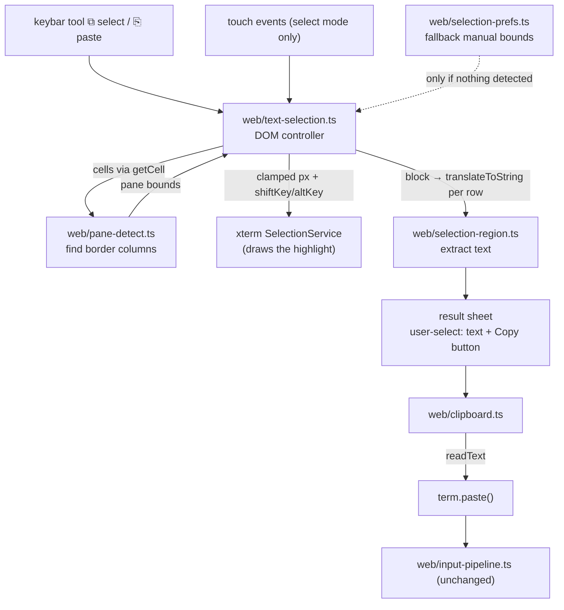

# Text Selection, Copy, and Paste Implementation Plan

> **For agentic workers:** REQUIRED SUB-SKILL: Use superpowers:subagent-driven-development (recommended) or superpowers:executing-plans to implement this plan task-by-task. Steps use checkbox (`- [ ]`) syntax for tracking.
>
> **Revision history:** v2 after scrutinize round 1 — the original plan reimplemented block selection from scratch; xterm.js already ships it. v3 after round 2 — fixed the iPad path (which silently sent clicks to the inner app), the keyboard popping up on every synthetic `mousedown`, the element-vs-viewport pixel origin, and a tap landing exactly on a border. v4 after round 3 — the new tools would have been buried at the end of the bar for every existing user; plus cell-reader allocation and a stale highlight.

**Goal:** Let a phone user highlight an arbitrary rectangular region of the terminal, get that text back **without** the vertical pane borders and neighbouring-pane content that a linear selection drags along, and then either copy it with one tap or hand it to the OS text menu (Copy / Share / Look Up). Plus a paste path back into the terminal.

**Why anything is needed:** `herdr` and `tmux` both enable SGR mouse reporting. While that is on, xterm.js forwards pointer events to the inner app instead of selecting, and the escape hatch (hold Shift, or Alt for a block) does not exist on a touch screen. `herdr`'s own copy cannot pick a sub-range.

**This is app-agnostic:** we never talk to the inner application. Everything reads xterm's client-side buffer, which holds "the characters currently drawn". `herdr`, `tmux`, `vim` splits, `lazygit` — one problem shape: a vertical border character in a fixed column.

## What xterm already does for us (verified in `node_modules/@xterm/xterm/lib/xterm.js`)

Do not rebuild these. Traced and confirmed:

| Capability | Evidence |
|---|---|
| **Block (column) selection exists.** `shouldColumnSelect(e) { return e.altKey && !(isMac && macOptionClickForcesSelection) }` sets `_activeSelectionMode = 3`. | `SelectionService.shouldColumnSelect` |
| **Forced selection while mouse reporting is on.** `Terminal` only forwards to the app when `coreMouseService.areMouseEventsActive && !this._selectionService.shouldForceSelection(e)`. `shouldForceSelection(e) { return isMac ? e.altKey && macOptionClickForcesSelection : e.shiftKey }`. | `Terminal` mousedown handler |
| **The DOM renderer already paints a column-shaped highlight.** `DomRendererRowFactory._isCellInSelection` has a dedicated `_columnSelectMode` branch. | `DomRendererRowFactory` |
| **Drag-scroll during selection** is skipped for column mode deliberately (`3 !== this._activeSelectionMode`). | `_handleMouseMove`, `_dragScroll` |

So a synthesized `mousedown` carrying **`shiftKey: true, altKey: true`** gives us forced block selection under mouse reporting, on every platform where `navigator.platform` is not a Mac string — i.e. Android and iPhone. `main.ts` already synthesizes mouse events this way (`mouseInit`, `web/main.ts:194`), so this is a small delta, not new machinery.

**What xterm does *not* do, and this plan adds:**

1. **Nothing tells it where the pane is.** On a phone you cannot aim at a column. We auto-detect the border columns and clamp the drag to the pane the finger started in, so a sloppy drag still returns clean text.
2. **No touch entry point.** Selection is mouse-driven; we need a mode and synthesized events.
3. **No way to reach the OS text menu.** The terminal is `user-select: none` / `touch-action: none`.

**And one thing we deliberately do not rely on:** `SelectionService.selectionText`. It returns `''` when the drag is exactly vertical (`if (e[0] === t[0]) return ''`), and on iPad the selection is linear rather than block-shaped (see below), so its text would carry the borders. Instead **xterm draws, we extract**: we know the block because we clamped it, so we read the text ourselves from the buffer. The extracted text is then identical on every platform.

**The iPad problem, and the one-line fix.** `navigator.platform` is `'MacIntel'` on iPad, so `isMac` is true there and `shouldForceSelection` becomes `e.altKey && macOptionClickForcesSelection`. With that option left at its default `false`, the condition is never satisfiable — which does not merely degrade the highlight, it means **the synthetic `mousedown` falls through to the inner app and is delivered to `herdr` as a real click**, moving the user's pane focus every time they try to select. Setting `macOptionClickForcesSelection: true` fixes it, and it is safe to set unconditionally:

| | `shouldForceSelection` | `shouldColumnSelect` |
|---|---|---|
| Android / iPhone (`isMac` false) | `e.shiftKey` → **true**, option ignored | `e.altKey && !(false && …)` → **true** |
| iPad / Mac (`isMac` true) | `e.altKey && true` → **true** | `e.altKey && !(true && true)` → **false** |

So one option value and one pair of modifier flags gives forced selection everywhere — block-highlighted on phones, linear-highlighted on iPad — and in **no** case does the event leak to the inner app. Only the highlight's shape differs; the copied text does not.

## Architecture



**Tech Stack:** TypeScript, Vite, xterm.js 6 (DOM renderer — no canvas/webgl addon is loaded, which is what makes both the column highlight and the sheet's native selection work), DOM APIs, Vitest, CSS, localStorage.

**Spec:** User request 2026-08-19. Decisions from brainstorming: (a) entry is a configurable keybar tool, not a gesture; (b) after picking a region the user gets a clean-text sheet where the **native** hold-to-select menu works, plus an explicit Copy button; (c) pane bounds are **auto-detected every time**, with a manually dragged bound persisted only as a fallback for when detection finds nothing.

## Global Constraints

- Node.js 22+ and pnpm. Run focused tests during tasks; before completion run `pnpm test` and `pnpm build`.
- Never use `@xterm/addon-attach`; all terminal input keeps going through `web/input-pipeline.ts`.
- Do not add `@xterm/addon-canvas` or `@xterm/addon-webgl`. The DOM renderer is load-bearing for Tasks 6 and 8.
- Set `macOptionClickForcesSelection: true` in the `Terminal` options. On non-Mac platforms it is read by neither predicate; on iPad it is the only thing that stops our synthetic clicks from being delivered to the inner app. Do not platform-sniff for it.
- Preserve the mobile interaction contract in `README.md`. In particular **do not take the 0.4s long-press-then-drag gesture** — it is the documented way to drag `herdr`'s sidebar divider.
- Keep `web/keybar.ts` layout constants synchronized with `web/style.css`.
- Selection never sends bytes to the PTY. Paste is the only new write path and goes through `term.paste()` → xterm `onData` → the existing pipeline, so bracketed-paste handling stays in one place.
- Keep changes scoped; `keybar.ts`, `key-definitions.ts`, `keybar-preferences.ts`, `style.css`, `README.md` all have uncommitted changes in the worktree.

## Known Limits (document, do not fix)

- **Only what is on screen.** In alternate-screen mode (`herdr`, `tmux`, `vim`) xterm has no scrollback; older output belongs to the inner app. Scroll it back into view with the existing gestures first. This is also why the plan does not try to make selection auto-scroll — xterm skips drag-scroll in column mode anyway.
- **Auto-detect only sees border *characters*.** A pane split by background colour alone is not detected; that is what the manual fallback bound is for.
- **iPad highlight.** On iPad the drawn highlight is linear rather than block-shaped, because `shouldColumnSelect` and `shouldForceSelection` cannot both hold there. The copied text is still block-clamped, because we extract it ourselves.
- **Repaint during selection.** The text is read at the moment the finger lifts. If the app repaints while the sheet is open the sheet keeps showing what was captured; that is intended.

---

## File Structure

- Create: `web/pane-detect.ts` — pure. Cell reader → vertical-border columns → pane column ranges.
- Create: `web/pane-detect.test.ts`
- Create: `web/selection-region.ts` — pure. Anchor/focus cells → normalized clamped block; block → text via an injected line reader.
- Create: `web/selection-region.test.ts`
- Create: `web/selection-prefs.ts` — localStorage schema for the fallback manual bounds.
- Create: `web/selection-prefs.test.ts`
- Create: `web/clipboard.ts` — `writeText` / `readText` with explicit failure reasons.
- Create: `web/clipboard.test.ts`
- Create: `web/text-selection.ts` — DOM controller: mode state, touch → clamped synthetic mouse, extraction, result sheet.
- Create: `web/text-selection.test.ts`
- Modify: `web/key-definitions.ts` — add a non-input `action` field and two tools.
- Modify: `web/key-definitions.test.ts`
- Modify: `web/keybar.ts` — route action keys to `onAction`; lit state for select mode.
- Modify: `web/keybar-preferences.ts` — insert catalog IDs the stored order does not know about at their `defaultOrder` position instead of appending them (Task 5).
- Modify: `web/keybar.test.ts`, `web/keybar-preferences.test.ts`
- Modify: `web/main.ts` — mount the controller, gate the gesture recognizer on select mode, wire `onAction`.
- Modify: `web/style.css`, `web/index.html` — select-mode affordances and the result sheet.
- Modify: `README.md`

---

### Task 1: Detect vertical pane borders from the visible grid

**Files:** create `web/pane-detect.ts`, `web/pane-detect.test.ts`

**Interfaces:**

```ts
/** อ่านตัวอักษรของเซลล์ — คืน '' เมื่อเป็นครึ่งขวาของอักษรกว้าง (CJK) */
export type CellReader = (row: number, column: number) => string;

export interface PaneBounds {
  start: number;  // คอลัมน์แรกของ pane (inclusive)
  end: number;    // คอลัมน์สุดท้ายของ pane (inclusive)
}

export interface DetectOptions {
  rows: number;
  columns: number;
  /** สัดส่วนของแถวที่ไม่ว่าง ซึ่งต้องเป็นอักษรเส้นแนวตั้ง ถึงนับเป็นเส้นแบ่ง */
  threshold?: number;   // default 0.8
  /** ต้องมีแถวที่ไม่ว่างอย่างน้อยเท่านี้ ถึงจะเชื่อผลการตรวจ */
  minRows?: number;     // default 4
}

export const BORDER_CHARS: ReadonlySet<string>;   // │ ┃ ║ ▏ ▕ ┆ ┊ ╎ ╏ |

export function detectBorderColumns(read: CellReader, opts: DetectOptions): number[];
export function panesFromBorders(borders: number[], columns: number): PaneBounds[];
export function paneContaining(panes: PaneBounds[], column: number): PaneBounds | null;
```

**Step 1: Write tests**
- [ ] 20×40 grid with `│` at column 20 on every row → `[20]`.
- [ ] Missing on 3 of 20 rows (85%) → still `[20]`; missing on 8 of 20 (60%) → `[]`.
- [ ] Entirely blank rows are excluded from the denominator: only 5 rows have content, all with `│` at column 10 → `[10]`.
- [ ] Fewer than `minRows` non-blank rows → `[]` (refuse to guess).
- [ ] `|` inside prose (`a|b` on 2 of 20 rows) → not detected.
- [ ] Two borders at columns 20 and 50 → both returned, in ascending order.
- [ ] `panesFromBorders([20], 80)` → `[{start:0,end:19},{start:21,end:79}]`; a border at column 0 or at `columns-1` emits no zero-width pane.
- [ ] Two adjacent borders (`[20,21]`, as double-width dividers produce) emit no zero-width pane between them.
- [ ] `panesFromBorders([], 80)` → `[{start:0,end:79}]`.
- [ ] `paneContaining` returns the pane for an interior column and `null` for a column that *is* a border.
- [ ] A wide-character row where `read` returns `''` for filler cells does not shift column indices.

**Step 2: Implement** — one pass over rows, per-column counters. A blank row is one where every cell is `''` or a space.

**Step 3: Verify** — `pnpm vitest run web/pane-detect.test.ts`.

---

### Task 2: The block model and text extraction

**Files:** create `web/selection-region.ts`, `web/selection-region.test.ts`

Absolute buffer line numbers throughout (`buffer.baseY + viewportRow`) so a block survives the viewport moving under it.

**Interfaces:**

```ts
export interface Cell { line: number; column: number; }

export interface Block {
  topLine: number;      // inclusive, absolute buffer line
  bottomLine: number;   // inclusive
  startColumn: number;  // inclusive
  endColumn: number;    // inclusive
}

/** อ่านข้อความช่วงคอลัมน์ของบรรทัด — endColumn เป็น inclusive ในสัญญานี้ */
export type LineReader = (line: number, startColumn: number, endColumn: number) => string;

export function blockFrom(anchor: Cell, focus: Cell): Block;
export function clampColumn(column: number, pane: PaneBounds | null): number;
/** pane ที่คอลัมน์นี้อยู่ — ถ้าจิ้มโดนเส้นแบ่งพอดี ให้เลือก pane ที่ใกล้กว่า */
export function nearestPane(panes: PaneBounds[], column: number): PaneBounds | null;
export function extractText(block: Block, read: LineReader, opts?: { trimTrailing?: boolean }): string;
```

`clampColumn` is deliberately a *point* clamp, not a block clamp: the controller clamps the finger position as it moves, so the block is never out of bounds in the first place and the highlight xterm draws matches what will be copied.

**Step 1: Write tests**
- [ ] `blockFrom` normalizes a drag in all four directions to the same block.
- [ ] A zero-size drag (anchor === focus) yields a 1×1 block, not an empty one — this is the case where xterm's own `selectionText` returns `''`.
- [ ] `clampColumn` pins below `start` and above `end`; a `null` pane is identity.
- [ ] `nearestPane` returns the pane containing the column, and for a column that *is* a border returns the nearer neighbouring pane (ties go left). A finger landing exactly on the divider is a normal event on a phone and must not silently fall back to full width.
- [ ] `extractText` joins rows with `\n` and asks the reader for exactly `startColumn..endColumn` on each row.
- [ ] `trimTrailing` (default true) strips trailing spaces per row, preserves interior spacing, and does not strip leading indentation.
- [ ] All-blank block yields `''`; trailing blank rows are dropped, interior blank rows kept.
- [ ] A single-row block yields no trailing `\n`.

**Step 2: Implement.**

**Step 3: Verify** — `pnpm vitest run web/selection-region.test.ts`.

---

### Task 3: Fallback manual bounds in localStorage

**Files:** create `web/selection-prefs.ts`, `web/selection-prefs.test.ts`

Storage key `browser-terminal:selection:v1`, mirroring the shape and validation style of `web/keybar-preferences.ts`.

**Interfaces:**

```ts
export interface SelectionPrefs {
  /** ขอบที่ผู้ใช้ลากเองล่าสุด — ใช้เฉพาะตอน auto-detect ไม่เจอเส้นเลย */
  manualBounds: PaneBounds | null;
  /** ความกว้าง terminal ตอนบันทึก — ถ้าตอนนี้ไม่เท่ากัน ให้ทิ้งค่าที่จำไว้ */
  columns: number;
}

export function loadSelectionPrefs(columnsNow: number, storage?: Storage): SelectionPrefs;
export function saveManualBounds(bounds: PaneBounds, columns: number, storage?: Storage): void;
export function clearManualBounds(storage?: Storage): void;
```

**Step 1: Write tests**
- [ ] Missing key → `{ manualBounds: null, columns: 0 }`.
- [ ] Malformed JSON, wrong types, `start > end`, `end >= columns`, negative values → same safe default, no throw.
- [ ] Round-trip save/load at the same width.
- [ ] Saved at 80 columns, loaded at 40 → `manualBounds` is `null`; stale bounds must not silently truncate a copy.
- [ ] A `Storage` whose `setItem` throws (private mode / quota) is swallowed.

**Step 2: Implement.**

**Step 3: Verify** — `pnpm vitest run web/selection-prefs.test.ts`.

---

### Task 4: Clipboard access with honest failure

**Files:** create `web/clipboard.ts`, `web/clipboard.test.ts`

`writeText` is available under every deployment documented in `README.md` (all secure contexts). `readText` is the fragile one: Chrome Android gates it behind a permission prompt, Safari iOS behind a per-use confirmation. It must be allowed to fail without breaking the flow.

**Interfaces:**

```ts
export type WriteResult = { ok: true } | { ok: false; reason: 'unsupported' | 'denied' | 'failed' };
export type ReadResult = { ok: true; text: string } | { ok: false; reason: 'unsupported' | 'denied' | 'failed' };

export function createClipboard(deps?: { clipboard?: Clipboard; isSecureContext?: boolean }): {
  write(text: string): Promise<WriteResult>;
  read(): Promise<ReadResult>;
};
```

**Step 1: Write tests**
- [ ] `write` succeeds and forwards the exact text.
- [ ] No `navigator.clipboard` → `{ ok:false, reason:'unsupported' }`, no throw.
- [ ] `isSecureContext === false` → `'unsupported'` without calling the API.
- [ ] Rejection with `NotAllowedError` → `'denied'`; any other rejection → `'failed'`.
- [ ] `read` mirrors all of the above, including `readText` being absent while `writeText` exists (Firefox shape).

**Step 2: Implement.** No `document.execCommand` fallback — every supported deployment is a secure context, and the result sheet's native menu (Task 8) is the real fallback for `write`.

**Step 3: Verify** — `pnpm vitest run web/clipboard.test.ts`.

---

### Task 5: Two new keybar tools that are not terminal input

**Files:** modify `web/key-definitions.ts`, `web/key-definitions.test.ts`, `web/keybar.ts`, `web/keybar.test.ts`, `web/keybar-preferences.test.ts`

`BarKey` is the security-critical byte path and must not learn about UI modes. `KeySpec` gains an optional `action`; a spec carries **either** `key` or `action`, never both.

```ts
export type KeyAction = 'select-mode' | 'paste';

export interface KeySpec {
  // ...existing fields, with `key` becoming optional
  key?: BarKey;
  action?: KeyAction;
  /** ปุ่มที่มีสถานะติด/ดับ — keybar จะถามสถานะมาทาสี */
  toggle?: boolean;
}

{ id: 'select', label: '⧉', title: 'Select text', category: 'core',
  action: 'select-mode', toggle: true, defaultVisible: true, defaultOrder: 115 }
{ id: 'paste', label: '⎘', title: 'Paste from clipboard', category: 'core',
  action: 'paste', defaultVisible: true, defaultOrder: 117 }

// mountKeybar handlers
onAction: (action: KeyAction) => void;
actionState: (action: KeyAction) => boolean;
```

**Step 1: Write tests**
- [ ] Catalog guard: every entry has exactly one of `key` / `action`. This catches a future entry that sets both.
- [ ] Tapping `select` calls `onAction('select-mode')` and **never** `onKey`.
- [ ] Tapping `paste` calls `onAction('paste')`.
- [ ] An action button is never repeatable and never registers as a modifier.
- [ ] `refresh()` applies the same lit class the locked-modifier state uses when `actionState('select-mode')` is true, and removes it when false.
- [ ] Existing preference tests still pass with two new default-visible IDs.

**Step 2a: Make `defaultOrder` mean something for existing users.** Traced: `normalizeKeybarPreferences` (`web/keybar-preferences.ts:33-35`) appends any catalog ID missing from the stored order to the **end**. A returning user's stored order already lists every pre-existing ID, so `select` and `paste` land after the F-keys and Ctrl shortcuts — visible (they are absent from stored `hidden`, so they are not hidden) but buried in the `⋯` overflow where nobody will find them. `defaultOrder: 115/117` is dead for anyone who has opened the app before, which is everyone who has used the 2026-08-18 tools bar.

Fix in `normalizeKeybarPreferences`: instead of appending, insert each unknown ID at the position implied by its catalog `defaultOrder` relative to the IDs already in the stored order. Do **not** bump the storage key to `v2` — that would silently discard the user's existing ordering and hidden set to solve a two-key problem.

Tests for this:
- [ ] A stored order containing every pre-`select` ID yields an order where `select` sits between `interrupt` and `pipe`, matching its `defaultOrder`.
- [ ] A stored order the user has deliberately rearranged keeps that arrangement; only the new IDs are inserted.
- [ ] An ID whose catalog neighbours are all hidden still lands in a sensible position rather than at the end.
- [ ] `select` and `paste` are visible by default for a returning user (absent from stored `hidden`).

**Step 2b: Implement the keybar changes.** `web/keybar.ts` reads `spec.key` in four places — the `onKey` call (`:179`), `isRepeatableKey(spec.key)` (`:182`), the `backtab` branch (`:196`), and `registerModifier` (`:200`). **All four** must be guarded on `spec.key` being present, not just the first; an unguarded `spec.key.kind` on an action spec is a `TypeError` at mount time that takes the whole keybar down.

**Step 3: Verify** — `pnpm vitest run web/key-definitions.test.ts web/keybar.test.ts web/keybar-preferences.test.ts`.

---

### Task 6: The selection controller

**Files:** create `web/text-selection.ts`, `web/text-selection.test.ts`

Everything xterm-shaped is injected, so the controller is testable against a fake port.

```ts
export interface TerminalPort {
  rows: number;
  columns: number;
  viewportTop(): number;                    // buffer.active.viewportY
  readCell(line: number, column: number): string;
  readLine(line: number, startColumn: number, endColumn: number): string;
  cellSize(): { width: number; height: number };
  /** ยิง mouse event สังเคราะห์เข้า xterm เพื่อให้มันวาดไฮไลต์ให้ */
  dispatchMouse(type: 'mousedown' | 'mousemove' | 'mouseup', x: number, y: number): void;
  clearSelection(): void;
}

export function createTextSelection(deps: {
  terminal: TerminalPort;
  loadPrefs: (columns: number) => SelectionPrefs;
  onRegionPicked: (text: string) => void;
  onModeChange: (active: boolean) => void;
  vibrate?: (ms: number) => void;
}): {
  toggle(): void;
  active(): boolean;
  pointerDown(x: number, y: number): void;
  pointerMove(x: number, y: number): void;
  pointerUp(x: number, y: number): void;
  cancel(): void;
};
```

**Flow.** `toggle()` runs `detectBorderColumns` once over the visible rows, builds panes (falling back to `prefs.manualBounds`, else full width), and fires `onModeChange(true)`. `pointerDown` converts px → cell, picks the pane with `nearestPane` (so a finger on the divider still gets a pane), records the anchor, and dispatches a synthetic `mousedown`. Each `pointerMove` clamps the column with `clampColumn`, converts **back** to px, and dispatches `mousemove` at the clamped x — so xterm's own highlight can never extend past the pane. `pointerUp` dispatches `mouseup`, builds the block with `blockFrom`, extracts the text with `extractText`, and calls `onRegionPicked`. Mode stays on until toggled off or cancelled.

**Pixel origin.** The clamp is computed in columns, but `dispatchMouse` must emit **viewport** coordinates, because `mouseInit` (`web/main.ts:194`) sets `clientX`/`clientY` and xterm converts them back with the screen element's bounding rect. So the conversion is `clientX = screenRect.left + column * cellWidth` for the low edge and `screenRect.left + (column + 1) * cellWidth - 1` for the high edge, with `screenRect` read fresh — the keybar expanding and the on-screen keyboard appearing both move it. Getting this wrong by one element offset does not fail loudly; it selects the wrong pane. Test the round-trip explicitly: for every pane edge, the emitted x must convert back to exactly the clamped column under `Math.floor((x - rect.left) / cellWidth)`.

**Step 1: Write tests** (fake `TerminalPort`)
- [ ] `toggle` flips `active()` and fires `onModeChange` both ways.
- [ ] Detection runs on `toggle`, not on construction, and re-runs on **every** `toggle`, so resizing the sidebar between uses is picked up.
- [ ] **Core regression test:** a drag that starts left of a border and ends well right of it yields text from the left pane only — no `│`, no right-hand text.
- [ ] The mirror case: started on the right of the border, yields the right pane only.
- [ ] The px round-trip: for every pane edge, and for a non-zero `screenRect.left`, `dispatchMouse` is called with an x that converts back to exactly the clamped column.
- [ ] A `pointerDown` exactly on a border column selects a real pane, not the full width.
- [ ] A `cellSize()` of `{width: 0}` (measured before the first paint) does not produce `Infinity`/`NaN` coordinates — the controller refuses to start a drag instead.
- [ ] No border detected + `manualBounds` present → manual bounds used.
- [ ] No border and no manual bounds → block spans the full width.
- [ ] A purely vertical drag (same column, several rows) yields one column of text, not `''`.
- [ ] px→cell conversion floors correctly and clamps at the viewport edges; a drag past the bottom row does not produce a line below the buffer, and a drag above the top does not produce a negative line.
- [ ] `viewportTop()` changing between `pointerDown` and `pointerUp` still yields the same absolute lines for the anchor.
- [ ] `cancel()` calls `clearSelection()` and leaves mode off.
- [ ] `pointerMove`/`pointerUp` without a preceding `pointerDown` are no-ops rather than throwing.

**Step 2: Implement.**

**Step 3: Verify** — `pnpm vitest run web/text-selection.test.ts`.

---

### Task 7: Wire the controller to xterm and the gestures

**Files:** modify `web/main.ts`, `web/style.css`

**Step 1: Implement `TerminalPort` over xterm**
- [ ] `viewportTop()` = `term.buffer.active.viewportY`.
- [ ] `readCell` via `line.getCell(column, reusedCell)?.getChars() ?? ''` — **not** string indexing into `translateToString`, which collapses wide characters and would shift every column right of a CJK glyph. Pass a single reused `CellData` and hoist `buffer.getLine(line)` out of the column loop: detection touches `rows × columns` cells (~8,000 on a landscape phone) on every `toggle`, and `getCell` without a target argument allocates a fresh object per call.
- [ ] `readLine` via `line.translateToString(false, startColumn, endColumn + 1)` — xterm's `endColumn` is exclusive, this plan's is inclusive. Trimming is `extractText`'s job.
- [ ] `dispatchMouse` reuses the existing `mouseInit` helper (`web/main.ts:194`) and adds **`shiftKey: true, altKey: true`** on all three event types. `shiftKey` makes `shouldForceSelection` true on Android/iPhone; `altKey` makes `shouldColumnSelect` true there and `shouldForceSelection` true on iPad. Both are required; neither is sufficient alone.
- [ ] **Restore focus after the synthetic `mousedown`.** xterm's mousedown handler runs `e.preventDefault(), this.focus(), …` unconditionally, which raises the on-screen keyboard over the region the user is trying to select. Reuse the exact pattern already used for `tap` and `dragStart` (`web/main.ts:223-246`): capture `keyboardVisible()` before dispatching and call `t.blur()` afterwards if it was hidden. Omitting this makes select mode unusable on Android, and it will look like a CSS problem rather than a focus one.
- [ ] Set `macOptionClickForcesSelection: true` in the `Terminal` constructor options (`web/main.ts:61`).
- [ ] `clearSelection()` = `term.clearSelection()`.
- [ ] `cellSize()` from a measured row element. Recompute after pinch-zoom, since the font size changes there and a stale cell width breaks the px round-trip.

**Step 2: Gate the gestures**
- [ ] While select mode is active, `bindTouch` routes single-finger `touchstart/move/end` to the controller and **does not** feed the recognizer, so no mouse report reaches the app and the 0.4s long-press-to-drag stays intact for normal mode.
- [ ] Two-finger pinch still reaches the recognizer while in select mode (font size stays adjustable); one-finger scroll does not — exit select mode to scroll. This is a documented trade-off, and it is also why the plan does not chase drag-scroll: xterm skips drag-scroll in column mode by design.
- [ ] Entering select mode closes the on-screen keyboard and calls `pipeline.clearModifiers()`. A sticky `Ctrl` left armed across a selection would fire on the next unrelated key.
- [ ] Leaving select mode calls `term.clearSelection()`. Note xterm also clears the selection on any user input (`onUserInput → clearSelection`), so a stray keystroke wipes the highlight; the sheet is what makes the result durable.
- [ ] Short vibrate on entering select mode, matching the existing drag-mode feedback.

**Step 3: Verify** — `pnpm test`, then a real phone against `herdr` and `tmux` with a vertical split.

---

### Task 8: The result sheet — native menu plus a Copy button

**Files:** modify `web/text-selection.ts`, `web/main.ts`, `web/style.css`, `web/index.html`

`onRegionPicked(text)` opens a sheet over the terminal holding the extracted text in a plain element with `user-select: text; -webkit-user-select: text; touch-action: auto`. The terminal's `touch-action: none` (`web/style.css:55`) and xterm's `user-select: none` do not apply here, so a hold gets the real OS menu — Copy, Share, Look Up — and the user can re-select a sub-range by hand.

- [ ] The text renders in a `<pre>` with `white-space: pre` and horizontal scroll, so column alignment survives.
- [ ] A **Copy** button calls `clipboard.write(text)`; on `ok` it flashes a confirmation and closes; on failure it shows "hold the text to copy" and keeps the sheet open — a real fallback rather than a dead end.
- [ ] A **Close** button and a backdrop tap dismiss the sheet; dismissing also leaves select mode and clears the highlight.
- [ ] Opening the sheet must not raise the on-screen keyboard: it steals no focus and contains no focusable text input.
- [ ] An empty extraction (the user tapped without dragging across anything but blanks) does not open a sheet; it calls `clearSelection()` and leaves select mode active so the user can try again. Skipping the clear leaves a highlight on screen that no longer corresponds to anything the user can act on.
- [ ] Test: text containing `\n` and trailing spaces renders exactly what `extractText` produced.
- [ ] Test: a failing `clipboard.write` leaves the sheet open and shows the fallback hint.

---

### Task 9: Paste

**Files:** modify `web/main.ts`, `web/text-selection.test.ts`

- [ ] `onAction('paste')` → `clipboard.read()` → on `ok`, `term.paste(text)`. Going through `term.paste` keeps bracketed-paste wrapping inside xterm and reaches the PTY through the existing `onData` → `input-pipeline` path; no new byte path is introduced.
- [ ] On `denied` / `unsupported`, show the existing status line telling the user to use the OS keyboard's own paste instead. Do not retry in a loop.
- [ ] Paste while select mode is active first leaves select mode, so the paste is not immediately wiped by xterm's clear-on-input.
- [ ] Test: a successful read calls `term.paste` with the exact text; a denied read calls it zero times.

---

### Task 10: Documentation

**Files:** modify `README.md`

- [ ] Add `⧉` and `⎘` to the mobile gesture/tool table, including that `⧉` lights up while active and that one-finger drag selects instead of scrolling while it is on.
- [ ] State that pane borders are detected automatically each time, that it therefore works with `herdr`, `tmux`, and any TUI with vertical splits, and that no configuration is needed.
- [ ] State the Known Limits from the top of this plan, including the iPad highlight caveat.
- [ ] Note the new localStorage key `browser-terminal:selection:v1` alongside `browser-terminal:keybar:v1`.

---

## Completion

- [ ] `pnpm test` passes.
- [ ] `pnpm build` passes.
- [ ] Manual check on a phone: `herdr` with a sidebar, and `tmux` with a vertical split — a multi-line selection in each returns text with no border characters and no text from the other pane.
