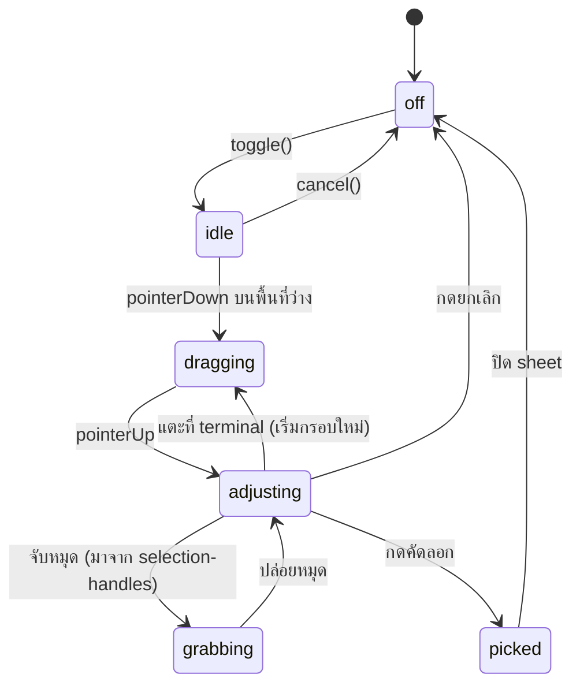

# Keybar sort invariant + adjustable selection handles

วันที่: 2026-08-21
สถานะ: design (ยังไม่เขียนโค้ด)

สองงานที่ไม่เกี่ยวกันเชิงเทคนิค แต่มาจากปัญหาเดียวกัน — จอมือถือเล็กเกินกว่าจะเล็งได้แม่นในครั้งเดียว
ทั้งการหาปุ่มในลิสต์ settings และการลากคลุมข้อความ

## Part 1 — หน้า settings เรียงตัวที่ติ๊กไว้บนสุด

### ปัญหา

`keybar-preferences.ts` เก็บ `order` เป็นลำดับเดียวที่ใช้ทั้งกับแถบปุ่มจริงและลิสต์ใน settings
ปุ่มที่ปิดอยู่จึงกระจายแทรกอยู่กลางลิสต์ การกด `←/→` เพื่อสลับตำแหน่งปุ่มที่เปิดอยู่สองปุ่ม
ต้องกดผ่านปุ่มที่ปิดที่คั่นอยู่หลายครั้ง โดยไม่เห็นผลอะไรบนแถบจริงระหว่างนั้น

### Invariant

`order` ต้องเป็น `[ปุ่มที่เปิด...] ++ [ปุ่มที่ปิด...]` เสมอ โดยรักษาลำดับสัมพัทธ์ภายในแต่ละกลุ่ม
(stable partition)

บังคับที่ `normalizeKeybarPreferences()` **ที่เดียว** — ทุกฟังก์ชันใน public API ของโมดูลนี้
เรียก normalize อยู่แล้ว (`visibleKeyIds`, `moveKey`, `setKeyHidden`, `saveKeybarPreferences`)
ค่าที่ผู้ใช้เดิมเก็บไว้ใน localStorage จึงจัดตัวเองถูกต้องทันทีที่โหลด ไม่ต้อง migrate
และไม่ต้อง bump storage key เป็น v2 (ซึ่งจะทิ้งลำดับที่ผู้ใช้จัดเองทั้งหมด)

#### ลำดับการทำงานใน normalize

ปัจจุบัน `normalizeKeybarPreferences()` เรียง `insertMissingIds()` ก่อนแล้วค่อยคำนวณ `hidden`
(`keybar-preferences.ts:56-58`) ลำดับนี้ต้องสลับ:

1. กรอง `order` ให้เหลือ id ที่รู้จักและไม่ซ้ำ (เหมือนเดิม)
2. **คำนวณ `hidden` ให้เสร็จก่อน**
3. `insertMissingIds()` — แทรก id ใหม่โดยเทียบ `defaultOrder` **เฉพาะกับ id ที่อยู่กลุ่มเดียวกัน**
4. partition

เหตุผลที่ต้องสลับ: `insertMissingIds()` หาตำแหน่งด้วย
`order.findIndex(existing => defaultOrderOf(existing) > target)` ซึ่งตั้งอยู่บนสมมติฐานว่า
`order` เรียงตาม `defaultOrder` โดยประมาณ พอมี invariant ใหม่ สมมติฐานนั้นพังทันที —
กลุ่มที่ซ่อนอยู่ท้ายลิสต์มี `defaultOrder` ต่ำได้ ปุ่มใหม่จึงอาจถูกแทรกลงกลางกลุ่มที่ซ่อน
แล้วโดน partition ดันกลับมาท้ายกลุ่มเปิดแทนตำแหน่งที่ตั้งใจ

ถ้าจำกัดการ scan ไว้ในกลุ่มเดียวกันตั้งแต่แรก ปุ่มใหม่จะไปอยู่ตำแหน่งที่ `defaultOrder`
ตั้งใจไว้จริงๆ ในกลุ่มของมัน และ partition ที่ตามมาไม่ขยับอะไรอีก

#### `defaultKeybarPreferences()` ต้องเคารพ invariant ด้วย

ปัจจุบันมันคืน `order: [...ALL_IDS]` ตรงๆ (`keybar-preferences.ts:22-24`) ซึ่ง **ละเมิด invariant**
เพราะ `ALL_IDS` เรียงตามแค็ตตาล็อก ไม่ได้แยกกลุ่ม และค่านี้ไม่ได้ผ่าน `normalizeKeybarPreferences()`
ก่อนถูกคืนออกไป (`loadKeybarPreferences` คืนมันตรงๆ ในเส้นทาง fallback ทั้งสองเส้น)
ต้องให้มัน partition ตัวเองด้วย ไม่งั้นผู้ใช้ใหม่กับผู้ใช้ที่กด Reset จะได้ลิสต์ที่ไม่เรียง

#### สิ่งที่ invariant นี้ *ไม่* เปลี่ยน

แถบปุ่มจริงไม่ขยับเลย — `keybar.ts:128` เรนเดอร์จาก `visibleKeyIds()` ซึ่ง filter ปุ่มที่ซ่อนทิ้งอยู่แล้ว
การย้ายปุ่มที่ซ่อนไปท้ายลิสต์ไม่เปลี่ยนลำดับสัมพัทธ์ของปุ่มที่เหลือ ผู้ใช้เดิมจึงไม่เจอแถบปุ่ม
เรียงใหม่หลังอัปเดต เปลี่ยนแค่หน้า settings

### ผลต่อ API เดิม

| ฟังก์ชัน | เปลี่ยนเป็น |
|---|---|
| `setKeyHidden(p, id, true)` | ย้าย id ไปท้ายสุดของ `order` (ได้ฟรีจาก normalize หลังอัปเดต `hidden`) |
| `setKeyHidden(p, id, false)` | ย้าย id ไปต่อท้ายกลุ่มที่เปิด (ได้ฟรีเช่นกัน) |
| `moveKey(p, id, dir)` | ตรึงไม่ให้ข้ามเส้นแบ่งกลุ่ม — คืนค่าเดิมถ้าเป้าหมายอยู่คนละกลุ่ม |
| `visibleKeyIds(p)` | ไม่เปลี่ยนพฤติกรรม (filter เหมือนเดิม แต่ input เรียงแล้ว) |

`moveKey` ปัจจุบันตรึงแค่ขอบ array (`target < 0 || target >= length`) ต้องเพิ่มเงื่อนไข
"id ที่ index และ id ที่ target ต้องมีสถานะ hidden เดียวกัน" ผลลัพธ์คือปุ่มที่เปิดอยู่
สลับได้กับปุ่มที่เปิดอยู่ด้วยกันเท่านั้น — ซึ่งคือความต้องการตั้งต้น "สลับกับตัวที่ติ๊กใกล้ๆ"

### UI

- ลิสต์ใน `makeCustomizePanel()` (`keybar.ts:309`) คั่นสองกลุ่มด้วยหัวข้อ `ซ่อนอยู่`
  แทรกก่อนแถวแรกที่ `hidden.has(spec.id)` เป็นจริง — เส้นแบ่งต้องมองเห็นได้
  ไม่ใช่กฎที่ผู้ใช้ต้องเดาเอง
- ถ้าไม่มีปุ่มที่ซ่อนเลย ไม่ต้องแสดงหัวข้อ
- ปุ่มสลับเปลี่ยนกลิฟจาก `←/→` เป็น `↑/↓` — ลิสต์เรียงแนวตั้ง ทิศที่แถวขยับจริงคือขึ้น/ลง
  ใช้กลิฟชุดเดียวกับปุ่มลูกศรในแค็ตตาล็อก (`key-definitions.ts:82-83`)
  aria-label เปลี่ยนตาม: `Move <label> up` / `Move <label> down`
- แถวแรกของกลุ่ม `↑` ต้อง disabled และแถวสุดท้ายของกลุ่ม `↓` ต้อง disabled
  (ปัจจุบันปุ่มกดได้เสมอแล้วไม่เกิดอะไร) ต้องเพิ่ม style `.keybar-mini-btn:disabled`
  ด้วย — ปุ่มที่กดไม่ได้แต่หน้าตาเหมือนเดิมอ่านว่า "พัง" ไม่ใช่ "สุดทางแล้ว"
- หัวข้อกลุ่มเป็นลูกเต็มความกว้างของ grid `.keybar-customize` เหมือน `.keybar-customize-title`
  ที่มีอยู่ (`style.css:227-241`) จึงไม่ต้องแตะ grid template
- หัวข้อเพิ่มความสูงให้ panel ซึ่งอยู่ในแถบปุ่ม → `--keybar-panel-height` และการ refit
  terminal (commit `cc241fe`) ต้องยังทำงานถูกหลังเพิ่มแถวนี้ — ตรวจด้วยตาบนมือถือ

### ปุ่ม Enter ใหม่

เพิ่มใน `KEY_CATALOG`:

```
{ id: 'enter', label: '⏎', title: 'Enter', category: 'core',
  key: { kind: 'literal', data: '\r' }, defaultVisible: true, defaultOrder: 112 }
```

`\r` ไม่ใช่ `\n` — PTY ในโหมด canonical แปลง CR เป็น newline เอง ส่วน `\n` ตรงๆ
จะกลายเป็น line feed ที่ไม่ submit คำสั่ง

`defaultOrder: 112` — ช่วง 115/117/118/119 ถูกจองไว้แล้วโดย `select` / `paste` / `settings` /
`fullscreen` (`key-definitions.ts:90-105`) 112 อยู่ระหว่าง `interrupt` (110) กับ `select` (115)
`insertMissingIds()` จะแทรกให้ผู้ใช้เดิมตามตำแหน่งนี้ — แต่ต้องแก้ให้ scan เฉพาะในกลุ่มก่อน
ตามที่ระบุไว้ข้างบน

`ALL_KEY_IDS` / `DEFAULT_KEY_IDS` derive จากแค็ตตาล็อกอยู่แล้ว ไม่ต้องแก้แยก

### Tests (`keybar-preferences.test.ts`, `key-definitions.test.ts`)

- normalize จัด partition ให้ order ที่สลับกันอยู่ และรักษาลำดับภายในกลุ่ม
- normalize ที่รับ order ซึ่ง partition ถูกต้องแล้ว คืนค่าเท่าเดิม (idempotent)
- `setKeyHidden(true)` ดัน id ไปท้ายสุด, `setKeyHidden(false)` ไปท้ายกลุ่มเปิด
- `moveKey` คืนค่าเดิมเมื่อเป้าหมายข้ามกลุ่ม
- `moveKey` ยังสลับได้ตามปกติภายในกลุ่ม
- `defaultKeybarPreferences()` คืนค่าที่ partition แล้ว
- prefs ที่บันทึกไว้ก่อนมีปุ่ม enter โหลดแล้วได้ enter อยู่ในกลุ่มเปิด ตำแหน่งหลัง interrupt
- prefs ที่ผู้ใช้จัดลำดับเองจนไม่เรียงตาม defaultOrder ยังได้ enter อยู่ในกลุ่มเปิด
  (ไม่หลุดไปกลุ่มซ่อน)
- ลำดับสัมพัทธ์ของปุ่มที่เปิดอยู่ก่อนอัปเดต ยังเท่าเดิมหลัง normalize — แถบปุ่มจริงไม่ขยับ
- ปุ่ม enter ส่ง `\r`

## Part 2 — หมุดปรับกรอบก่อนยืนยัน

### ปัญหา

`text-selection.ts` ปัจจุบันจบเด็ดขาดที่ `pointerUp` → `finish()` → `onRegionPicked(text)` → เปิด sheet
ลากพลาดครั้งเดียวคือต้องปิดแผ่น เข้าโหมดใหม่ ลากใหม่ทั้งอัน บนจอมือถือนี่คือทุกครั้ง

### State machine



`dragging` กับ `grabbing` ใช้โค้ดเส้นทางเดียวกัน ต่างกันแค่ที่มาของ `anchor`:
ลากใหม่ = anchor คือจุดที่นิ้วลง, ลากหมุด = anchor คือ **มุมตรงข้าม** ของกรอบเดิม
`blockFrom()` ที่มีอยู่คำนวณ min/max ให้อยู่แล้ว จึงไม่ต้องแยกตรรกะ

### แบ่งความรับผิดชอบ

`text-selection.ts` ยังไม่รู้จัก DOM ตามสัญญาเดิมของไฟล์ เพิ่มเข้าไปแค่:

- state `adjusting` และ `currentBlock(): Block | null`
- callback ใหม่ `onBlockChange(block: Block | null)` ยิงทุกครั้งที่กรอบเปลี่ยนหรือหาย
- `beginHandleDrag(corner: 'start' | 'end')` — ตั้ง anchor เป็นมุมตรงข้าม แล้วเข้าสถานะ
  `grabbing` จากนั้น `pointerMove` / `pointerUp` เดิมทำงานต่อได้เลยโดยไม่ต้องแยกสาขา
  `drag.pane` ต้องเป็น `nearestPane(panes, anchor.column)` **ไม่ใช่ `null`** — ไม่งั้น
  `clampColumn()` กลายเป็น no-op และการลากหมุดจะดึงเส้นแบ่ง pane ติดมา ซึ่งคือปัญหา
  ที่ทั้งไฟล์นี้ตั้งใจแก้ตั้งแต่แรก
- `state(): 'off' | 'idle' | 'dragging' | 'adjusting' | 'grabbing'` — main.ts ใช้ตัดสินว่า
  ต้องแสดง overlay ไหม overlay โผล่เฉพาะ `adjusting` เท่านั้น ระหว่างลากไม่ต้องมีหมุด
  ให้รก และ `onBlockChange` ที่ยิงถี่ระหว่างลากจะไม่ทำให้ overlay กะพริบ
- `blockRect(): { left, top, right, bottom } | null` — พิกัดพิกเซลของกรอบ อยู่ในโมดูลนี้
  เพราะมันคือตัวเดียวที่มี `pixelAt()` และ `screenMetrics()` main.ts แค่ส่งค่านี้ต่อให้ overlay
- `confirm()` เรียก `onRegionPicked(text)` แต่ **ไม่ออกจากโหมด** (ดูหัวข้อ "การจบโหมด")

**ไม่มี hit-testing ด้วยพิกเซลใน `text-selection.ts`** — หมุดเป็น DOM element ที่รับ touch
ของตัวเอง มันรู้ว่าถูกจับแล้วเรียก `beginHandleDrag()` ตรงๆ การคำนวณระยะจากมุมจึงไม่จำเป็น
และตัดสาขา "แตะโดนหมุดหรือเปล่า" ออกจาก touch handler ของ terminal ไปด้วย

โมดูลใหม่ `web/selection-handles.ts` เป็นเจ้าของ DOM ทั้งหมด — โครงตามแบบ `selection-sheet.ts`
(factory + deps injection + `element` ให้ main.ts เอาไป append):

- หมุดสองอันที่มุมบนซ้าย / ล่างขวาของกรอบ
- แถบยืนยันลอย `[คัดลอก] [ยกเลิก]`
- `place(rect | null)` รับพิกัดพิกเซลที่คำนวณมาแล้ว ไม่คำนวณเอง
- **ตรรกะการวางทั้งหมดต้องเป็นฟังก์ชันบริสุทธิ์ที่ export แยก** ไม่ใช่โค้ดที่ฝังอยู่ใน
  factory — `vitest.config.ts` ตั้ง `environment: 'node'` และ repo ไม่มี jsdom/happy-dom
  ติดตั้งไว้ เทส DOM จึงรันไม่ได้เลย นี่คือเหตุผลที่ `selection-sheet.test.ts` ยาว 19 บรรทัด
  ทั้งที่โมดูลยาว 121 บรรทัด — มันเทสเฉพาะ `sheetStateAfterCopy()` กับ `sheetHintText()`
  ทำตามแบบเดียวกัน:
  - `handleAnchors(block)` → คู่มุมที่เป็นหมุด
  - `confirmBarPlacement(rect, limits)` → `{ side: 'above' | 'below' | 'over', top }`
  - `handleVisibility(rect, viewport)` → หมุดไหนอยู่ในจอบ้าง
  ส่วนการต่อ DOM ไม่มีเทสอัตโนมัติ ตรงกับที่ทั้ง repo ทำอยู่ — ถ้าอยากได้ต้องเพิ่ม jsdom
  และแก้ config ซึ่งอยู่นอกขอบเขตงานนี้

### การซิงก์ตำแหน่งหมุด

`Block` ใช้เลขบรรทัดสัมบูรณ์ใน buffer อยู่แล้ว จึงยังหมายถึงข้อความเดิมเมื่อ viewport เลื่อน
แต่ **ตำแหน่งพิกเซลของหมุดไม่ใช่** ต้องคำนวณใหม่เมื่อ:

- กรอบเปลี่ยน (`onBlockChange`)
- terminal เลื่อน — ผูกกับ `terminal.onScroll` ของ xterm ใน main.ts
- terminal resize / คีย์บอร์ดโผล่ปิด — จุดเดียวกับที่ `terminal-resize.ts` ทำงานอยู่
- กรอบเลื่อนพ้น viewport ขึ้นบนหรือลงล่าง → ซ่อนหมุดนั้น แต่ **ไม่ยกเลิกกรอบ**
  แถบยืนยันยังอยู่ ผู้ใช้ยังกดคัดลอกได้

การเลื่อนนี้มาจาก output ของ PTY เท่านั้น ไม่ใช่จากนิ้วผู้ใช้ — ในโหมดเลือก
`stopGestures()` ถูกเรียก (`main.ts:271`) และนิ้วเดียวทุกครั้งถูก `selectionOwnsTouch()`
ยึดไป การเลื่อนจอด้วยนิ้วจึงทำไม่ได้อยู่แล้วตั้งแต่ก่อนงานนี้

`blockRect()` **ต้องไม่ clamp ค่าให้อยู่ในจอ** — คืนพิกัดจริงแม้จะติดลบหรือเกินความสูง
แล้วให้ `selection-handles.ts` เป็นคนตัดสินว่าจะซ่อนอันไหน ถ้า clamp ตั้งแต่ต้นทาง
หมุดจะไปเกาะขอบจอโดยที่ผู้ใช้เข้าใจว่ากรอบสิ้นสุดตรงนั้น แล้วลากต่อจากตำแหน่งที่ผิด

main.ts เป็นตัวเชื่อม: เมื่อเกิด trigger ข้างบน มันเรียก `selection.blockRect()`
แล้วส่งผลไปที่ `handles.place(rect)` ไม่คำนวณพิกเซลเอง

### การวาง overlay และการกันชนกับ touch handler เดิม

overlay append เข้า `#app` เหมือน `sheet.element` (`main.ts:256`) แต่ `.app` เป็น flex column
ที่มีความสูงคงที่ (`style.css:44-48`) ของที่ append เข้าไปเฉยๆ จะกลายเป็น flex item
และไปเบียดความสูงของ `.terminal` — overlay จึงต้องเป็น `position: fixed; inset: 0`
เหมือนที่ `.sheet` ทำอยู่ พร้อม:

- `pointer-events: none` ที่ root, `pointer-events: auto` ที่หมุดกับแถบยืนยัน
- `touch-action: none` ที่หมุด — `.terminal` ตั้งไว้แล้ว (`style.css:55-59`) แต่ overlay
  อยู่นอกมัน ถ้าไม่ตั้ง เบราว์เซอร์จะกินการลากไปทำ scroll หน้าเว็บก่อนถึง handler
- `z-index: 15` — ต่ำกว่า `.sheet` (20, `style.css:296`) เพื่อให้แผ่นผลลัพธ์ทับได้

**ไม่ต้องเพิ่ม bail logic ใน touch handler ของ terminal** touch listener ทั้งหมดผูกกับ
element ของ terminal โดยตรง (`main.ts:536, 553, 566`) นิ้วที่ลงบนหมุดมี target เป็นหมุด
ซึ่งไม่ใช่ลูกของ terminal element event นั้นจึงไม่ไปถึง handler ตั้งแต่แรก
`e.preventDefault()` บรรทัดแรกที่เรียกเสมอจึงไม่กระทบ

`selectionOwnsTouch()` (`main.ts:522`) ไม่ต้องแก้เช่นกัน — ทุกสถานะที่โหมดยังเปิดอยู่
การแตะที่ terminal เป็นของ selection เหมือนเดิม ต่างกันแค่ในสถานะ `adjusting`
มันหมายถึง "เริ่มกรอบใหม่" ซึ่งทิ้งกรอบเดิมทันที ไม่ว่านิ้วจะลงในกรอบหรือนอกกรอบ
(ทางเดียวที่จะปรับกรอบเดิมคือจับหมุด)

### ตำแหน่งแถบยืนยัน

วางเหนือกรอบเป็นค่าตั้งต้น ตกลงใต้กรอบเมื่อกรอบชิดขอบบน และ **ต้องไม่ทับแถบปุ่ม**
ซึ่งกินพื้นที่ล่างจออยู่ตลอด — ขอบล่างที่ใช้ได้คือ `top` ของ element แถบปุ่ม ไม่ใช่ขอบ viewport
main.ts ส่งค่านี้เข้าไปพร้อม rect เพราะมันเป็นตัวเดียวที่เห็นทั้งสอง element

ถ้าไม่มีที่ว่างพอทั้งบนและล่าง ให้ทับกรอบตรงกลางแบบกึ่งโปร่ง ดีกว่าหลุดจอไปเงียบๆ

### การจบโหมด

`confirm()` เรียก `onRegionPicked(text)` เพื่อเปิด sheet แต่ยังคงโหมดไว้ — ตรงกับพฤติกรรม
ปัจจุบันที่ `sheet.onClose` เป็นคนเรียก `selection.cancel()` (`main.ts:254`) ถ้า `confirm()`
ออกจากโหมดเอง `setMode(false)` จะเรียก `terminal.clearSelection()` ทำให้ไฮไลต์หายไป
ใต้ sheet ที่เพิ่งเปิด ทั้งที่ข้อความบน sheet ยังหมายถึงกรอบนั้นอยู่

แต่หมุดกับแถบยืนยันต้องซ่อนตอน sheet เปิด ไม่งั้นมันจะลอยทับ backdrop —
`onRegionPicked` ใน main.ts สั่ง `handles.place(null)` ก่อนเปิด sheet
ปิด sheet → `cancel()` → `onBlockChange(null)` → overlay หายตามปกติ

ปุ่ม "ยกเลิก" บนแถบยืนยันเรียก `cancel()` ตรงๆ (ออกจากโหมดทั้งหมด) ไม่ใช่แค่ล้างกรอบ —
เป็นทางออกเดียวที่ไม่ต้องเอื้อมไปกดปุ่ม `⧉` บนแถบปุ่ม

### กรอบว่าง

`finish()` เดิมล้าง selection ทิ้งเมื่อ `extractText` ได้ค่าว่าง ตอนนี้เปลี่ยนเป็น:
คงกรอบไว้ แสดงหมุดตามปกติ แต่ปุ่มคัดลอก disabled — ผู้ใช้ลากหมุดต่อจนโดนข้อความได้เลย
โดยไม่ต้องเริ่มใหม่

### Haptics

`vibrate(10)` ตอนจับหมุดสำเร็จ — ตัวเดียวกับที่ใช้ตอนเข้าโหมด ให้รู้ว่าจับติดแล้ว
ไม่ใช่กำลังลากกรอบใหม่อยู่ เรียกจากใน `beginHandleDrag()` ของ `text-selection.ts`
ไม่ใช่จาก `selection-handles.ts` เพราะ `deps.vibrate` ถูก inject ไว้ที่โมดูลนั้นอยู่แล้ว
(`main.ts:280`) การเพิ่ม dep เดียวกันซ้ำอีกโมดูลไม่มีอะไรได้กลับมา

### Tests

`text-selection.test.ts` (ใช้ TerminalPort ปลอมที่มีอยู่แล้ว):

- pointerUp ไม่เรียก `onRegionPicked` อีกต่อไป แต่เข้าสถานะ `adjusting` และยิง `onBlockChange`
- `beginHandleDrag('start')` แล้ว `pointerMove` เปลี่ยนเฉพาะมุมบนซ้าย มุมล่างขวาคงเดิม
  (และกลับกันสำหรับ `'end'`)
- ลากหมุดข้ามอีกมุมไป กรอบพลิกได้ถูกต้อง (`blockFrom` min/max)
- pointerDown ที่ terminal ขณะ `adjusting` เริ่มกรอบใหม่ ทิ้งกรอบเดิม ทั้งกรณีนิ้วลงในกรอบและนอกกรอบ
- `confirm()` เรียก `onRegionPicked` ด้วยข้อความของกรอบปัจจุบัน และ **ยังอยู่ในโหมด**
- `blockRect()` คืน null เมื่อไม่มีกรอบ และคืนพิกัดที่ตรงกับ `pixelAt()` ของมุมทั้งสองเมื่อมี
- กรอบว่างยังอยู่ในสถานะ `adjusting` ไม่ถูกล้างทิ้ง
- การลากหมุดยังตรึงคอลัมน์ใน pane เดิม (`clampColumn` ไม่ถูกข้าม)

`selection-handles.test.ts` (ใหม่, node — ฟังก์ชันบริสุทธิ์เท่านั้น):

- `handleAnchors(block)` คืนมุมบนซ้าย/ล่างขวาถูกต้อง รวมกรณีกรอบสูงบรรทัดเดียว
- `confirmBarPlacement` คืน `'above'` ตามค่าตั้งต้น
- คืน `'below'` เมื่อกรอบชิดขอบบนจนแถบไม่พอที่
- คืน `'over'` เมื่อไม่พอทั้งบนและล่าง
- ค่า `top` ที่คืนไม่เคยล้ำเข้าไปในพื้นที่แถบปุ่มที่ส่งเข้ามาเป็น bottom limit
- `handleVisibility` ซ่อนหมุดที่ y ติดลบหรือเกินความสูง viewport และไม่ซ่อนอีกอันในกรอบเดียวกัน

## ลำดับการทำ

1. Part 1 ทั้งหมด (invariant + tests → UI + ปุ่ม Enter) — แยกจาก Part 2 สิ้นเชิง ทำจบก่อนได้
2. Part 2: state machine ใน `text-selection.ts` + tests
3. Part 2: `selection-handles.ts` + tests + CSS (fixed overlay, z-index, touch-action)
4. Part 2: เชื่อมใน `main.ts` (append overlay, ผูก `onScroll` / resize, ซ่อน overlay ตอนเปิด sheet)
5. `pnpm test` + `pnpm build`

## สิ่งที่จงใจไม่ทำ

- **ไม่แตะแผ่นผลลัพธ์** — `.sheet-text` ตั้ง `user-select: text; touch-action: auto` ไว้แล้ว
  (`style.css:330`) และ touch handler ทั้งหมดผูกกับ element ของ terminal ไม่ใช่ document
  การกดค้างเลือกเองด้วยเมนู native จึงใช้ได้อยู่แล้ว ยืนยันกับผู้ใช้แล้ว
- **ไม่ทำ drag-and-drop จัดลำดับในลิสต์ settings** — ปุ่ม `↑/↓` แม่นกว่าบนจอสัมผัส
  และ invariant ใหม่ทำให้จำนวนครั้งที่ต้องกดลดลงจนไม่คุ้มกับความซับซ้อน
- **ไม่ทำ multi-block selection** — นอกขอบเขต
- **ไม่ทำ auto-scroll ตอนลากหมุดชนขอบจอ** — กรอบจึงยังใหญ่ได้ไม่เกินหนึ่งหน้าจอ
  เป็นข้อจำกัดเดิมที่มีมาก่อนงานนี้ ไม่ใช่ของใหม่ ถ้าจะแก้ต้องแตะทั้ง gesture pipeline
  ซึ่งใหญ่กว่างานนี้ทั้งงาน
- **ไม่เพิ่ม jsdom เข้า test setup** — ดูเหตุผลในหัวข้อ Tests
