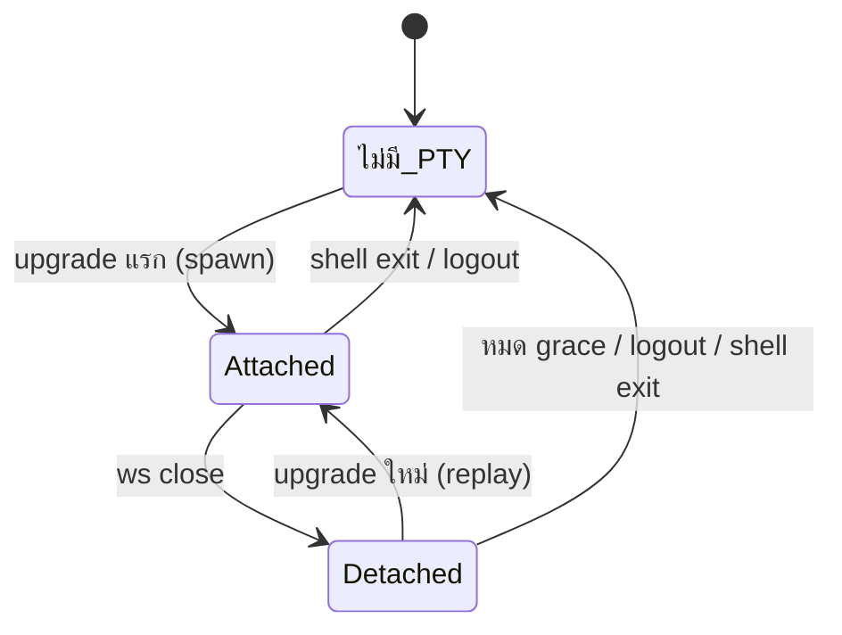

# PTY ที่อยู่รอดข้ามการ disconnect + ทางออกที่ไม่ตัน

วันที่: 2026-08-26
สถานะ: approved — **ส่งมอบเฉพาะเฟส 2**, เฟส 1 เลื่อนเป็น follow-up

## สิ่งที่จะทำจริงในรอบนี้

รอบนี้ทำ **เฟส 2 เท่านั้น** (ทางออกที่ไม่ตันฝั่ง client) ไม่แตะ `server/` เลย

เฟส 1 (PTY persistence) ถูกเลื่อนออกไปโดยรู้ตัวว่าแลกอะไร: **อาการที่ 1 จะไม่หาย**
สลับแท็บกลับมายังเจอจอว่าง เพราะ shell ตายไปตั้งแต่สายหลุด สิ่งที่เฟส 2 ให้คือ
พากลับถึง prompt ที่ใช้ได้เร็วขึ้นและไม่มีทางตัน ไม่ใช่พากลับไปหา shell ตัวเดิม

เฟส 2 ถูกออกแบบให้ไม่ต้องรื้อทีหลัง: เมื่อทำเฟส 1 ในภายหน้า สิ่งที่เพิ่มเข้ามาคือ
control frame `attached`/`fresh` เพียงอย่างเดียว โค้ดของเฟส 2 ยังใช้ได้ทั้งหมด

### สิ่งที่ตัดออกจากเฟส 2 เพราะไม่มีเฟส 1 รองรับ

- control frame `{"t":"attached","fresh":…}` และการเพิ่มสาขาอ่าน text frame ฝั่ง client —
  ไม่มีอะไรให้ replay `term.reset()` ยังยิงทุก `onopen` ตามเดิม
- ข้อ 2.4 ยังทำครบ แต่ **guard socket ซ้อนกลายเป็นข้อบังคับ ไม่ใช่ของแถม** ดูเหตุผลในหัวข้อนั้น

## ปัญหา

ผู้ใช้รายงานสามอาการ ซึ่งการ trace โค้ดพบว่ามาจากรากเดียวกันสองราก:

1. resize หรือหุบคีย์บอร์ดตอนสายหลุด แล้วกลับมา → จอค้าง บางทีเหมือนฟรีซ
2. หลุดแล้วกลับมา → ค้างอยู่หน้า login โดยไม่มีปุ่มอะไรให้กด
3. กด refresh ของเบราว์เซอร์เอง → เข้าได้ทันทีโดยไม่ต้องกรอกรหัส

### ราก A — shell ตายทุกครั้งที่สายหลุด

`server/index.ts:302` เรียก `attachPty(ws, …)` ทุกการ upgrade และ `server/pty.ts:29`
`pty.spawn()` สร้าง process ใหม่ทุกครั้ง ส่วน `server/pty.ts:55` ผูก `term.kill('SIGHUP')`
ไว้กับ `ws.on('close')`

lifecycle ของ PTY จึงเท่ากับ lifecycle ของ WebSocket เป๊ะๆ — เน็ตมือถือกระตุกหนึ่งครั้ง
เท่ากับปิดคอมทิ้ง ฝั่ง client `web/main.ts:806` `term.reset()` ใน `onopen` ล้างจอตามไป
(คอมเมนต์ในโค้ดยอมรับตรงๆ ว่า "PTY ใหม่คือ process ใหม่")

อาการ 1 จึงไม่ใช่บั๊ก layout เป็นหลัก — มันคือจอว่างของ shell ที่เพิ่งเกิดใหม่

### ราก B — bootstrap ไม่มีทางออกเมื่อเน็ตไม่พร้อม

`web/main.ts:911`

```ts
if (await checkSession() === 'valid') await startSession();
```

`'unreachable'` (เน็ตล่มตอนโหลดหน้า) ไม่มี retry ไม่มีปุ่ม — จบที่หน้า login ถาวร
เมื่อแท็บถูกเบราว์เซอร์มือถือทิ้งแล้วโหลดใหม่ตอนสัญญาณยังไม่กลับ ผู้ใช้จะติดอยู่ตรงนั้น
จนกว่าจะหาปุ่ม refresh ของเบราว์เซอร์เจอเอง ซึ่งอธิบายอาการ 2 และ 3 พร้อมกัน

## เป้าหมาย

- สายหลุด สลับแอป สลับแท็บ หมุนจอ ต้องไม่ฆ่างานที่รันค้างอยู่
- กลับมาแล้วเห็นจอเดิมพร้อม output ที่เกิดระหว่างหลุด
- ไม่มีสถานะไหนในแอปที่ผู้ใช้ต้องพึ่งปุ่ม refresh ของเบราว์เซอร์

### นอกขอบเขต

- หลาย session พร้อมกัน — server บังคับ session เดียวอยู่แล้ว (`server/index.ts:304`) และ design นี้คงไว้
- ทำให้ PTY อยู่รอดข้ามการ restart ของ server process
- ปรับ jank ของ `visualViewport` ระหว่าง IME animation (ยังไม่มีหลักฐาน — แยกเป็นงานอื่น)

## เฟส 1 (follow-up — ยังไม่ทำในรอบนี้) — PTY ผูกกับ session ไม่ใช่กับ socket

### แนวคิด

server มี PTY ได้อย่างมากหนึ่งตัว (สอดคล้องกับตัวแปร `active` ที่มีอยู่แล้ว) WebSocket
กลายเป็นแค่ "ท่อที่เสียบเข้า/ถอดออกได้" จาก PTY ตัวนั้น



### โมดูลใหม่ `server/session-pty.ts`

รับผิดชอบอย่างเดียว: ถือ PTY ที่ยังอยู่ และเสียบ/ถอด socket

```ts
interface SessionPty {
  /** เสียบ socket เข้ากับ PTY — spawn ใหม่ถ้ายังไม่มี */
  attach(ws: WebSocket, dims: { cols: number; rows: number }):
    { fresh: boolean; pid: number };
  /** ฆ่าทิ้งทันที ใช้ตอน logout และตอนปิด server */
  kill(): void;
}
```

`attach()` แยกสองทาง:

- **ไม่มี PTY อยู่** → `pty.spawn()` ตามเดิม, `fresh: true`
- **มี PTY ที่ detached อยู่** → ยกเลิก grace timer, `term.resize(cols, rows)` ตามขนาดที่
  client ส่งมาใน query string, replay ring buffer, `fresh: false`

`fresh` เดินทางไปถึง client เป็น control frame ก่อน byte แรกของ replay:
`{"t":"attached","fresh":true|false}` — client ใช้ค่านี้ตัดสินว่าจะ `term.reset()` หรือไม่
นี่คือจุดเดียวที่ทำให้จอไม่ถูกล้างทิ้งตอนกลับมา

ทิศทาง control frame กลับด้านจากของเดิม: ทุกวันนี้ text frame วิ่งจาก client ไป server
อย่างเดียว (`{"t":"resize"}`) และ `web/main.ts:810` เขียนไว้ว่า
`if (ev.data instanceof ArrayBuffer) term.write(...)` ซึ่ง**ทิ้ง text frame เงียบๆ**
client จึงต้องเพิ่มสาขาอ่าน JSON ในทางกลับ ไม่งั้น `attached` จะหายไปโดยไม่มี error

### Ring buffer

`term.onData` ต้อง**ไม่หยุดอ่าน**ตอน detached ไม่งั้น process ที่กำลังรันจะถูก block
ที่ pipe (build ที่รันค้างจะหยุดกลางคัน) ดังนั้น:

- ทุก chunk ที่ออกจาก PTY ถูก push เข้า ring buffer เสมอ ไม่ว่าจะ attached หรือไม่
- ring มีเพดานเป็นจำนวน byte (`PTY_REPLAY_BYTES`, ค่าเริ่มต้น 256 KB) เกินแล้วทิ้งตัวเก่าสุด
- ตอน attached ยัง push เข้า `createOutbound` เหมือนเดิมเพื่อคง backpressure

**ข้อควรระวังที่ต้องมีเทสต์คุม:** `createOutbound` สั่ง `term.pause()` เมื่อ backpressure
สูง ถ้า socket ตายระหว่างที่ PTY ถูก pause ไว้ การ dispose outbound ต้อง `term.resume()`
เสมอ ไม่งั้น PTY ที่รอดมาจะค้างอยู่ในสภาพ paused ตลอดกาล — เป็น failure mode ที่เงียบที่สุด
ของ design นี้

การตัดกลางลำดับ escape sequence ตอน ring ทิ้งตัวเก่าเป็นเรื่องที่ยอมรับได้: xterm
จะเจอ sequence ที่ขาดหัวแล้วข้ามไป ผลแย่ที่สุดคือสีเพี้ยนหนึ่งบรรทัดบนสุดของ replay
การพยายามตัดตามขอบ sequence เพิ่มความซับซ้อนโดยไม่คุ้ม

### Grace period และการฆ่าทิ้ง

PTY ที่ detached ต้องตายเมื่อเข้าเงื่อนไขใดเงื่อนไขหนึ่ง:

| เงื่อนไข | ทำไม |
|---|---|
| ครบ `PTY_GRACE_MS` (ค่าเริ่มต้น 5 นาที) โดยไม่มีใครกลับมา | ไม่ทิ้ง process ค้างไว้ไม่มีกำหนด |
| `epochs.bump()` จาก `/api/logout` (`server/index.ts:203`) | logout ต้องแปลว่าเข้าถึงไม่ได้จริง |
| PTY exit เอง | เดิมมี `term.onExit` อยู่แล้ว |
| server ปิดตัว | ไม่ทิ้ง orphan |

`PTY_GRACE_MS = 0` ปิดฟีเจอร์นี้ทั้งหมด กลับไปเป็นพฤติกรรมเดิม — ใช้เป็นทางถอยถ้าเจอปัญหา
บน production

### ความปลอดภัย

design นี้แตะพื้นที่ security-critical จึงระบุให้ชัดว่าอะไร**ไม่**เปลี่ยน:

- ทุก upgrade ยังผ่าน `originAllowed()` + `sessionValid()` ก่อนเสมอ (`server/index.ts:299-300`)
  การมี PTY ค้างอยู่ไม่ได้เปิดทางเข้าใหม่ ต้องมี cookie ที่ยัง valid ถึงจะ attach ได้
- PTY ที่รอดต้องผูกกับ epoch ที่มันเกิดมา ถ้า `epochs.current()` เปลี่ยนไปแล้ว ห้าม attach —
  ให้ฆ่าแล้ว spawn ใหม่ ไม่งั้น cookie เก่าที่ถูกเพิกถอนไปแล้วจะยังได้ shell เดิมกลับมา
- ยังคงมีได้อย่างมาก 1 PTY ต่อ server ไม่มีทางให้ผู้โจมตี spawn สะสม
- ring buffer อยู่ใน memory เท่านั้น ไม่เขียนลงดิสก์ — output ของ terminal มี secret ปนได้เสมอ

### ผลข้างเคียงที่ตั้งใจ

การเปิดแท็บที่สองจะ "ย้าย" session มาที่แท็บใหม่พร้อมจอเดิม แทนที่จะได้ shell เปล่า
socket เก่ายังโดนเตะด้วย 4000 เหมือนเดิม พฤติกรรมนี้ดีขึ้นและไม่ต้องแก้อะไรเพิ่ม

## เฟส 2 (ของที่ส่งมอบรอบนี้) — ไม่มีทางตันฝั่ง client

### 2.1 Terminal สร้างครั้งเดียว

`startSession()` ปัจจุบันเรียก `initTerminal()` ใหม่ทุกครั้งโดยไม่มี teardown → Terminal
ซ้อนกันใน `#terminal` และ listener ซ้อนกันหลังเข้า login รอบสอง

แก้โดยย้ายการสร้าง Terminal ไปทำครั้งเดียว แล้วให้ `startSession()` เหลือแค่สลับ visibility
กับเรียก `connect()` — ตัดปัญหาทั้งหมวดทิ้งโดยไม่ต้องเพิ่มโมดูลบริหาร teardown

### 2.2 bootstrap ที่ retry ได้

`'unreachable'` ตอนโหลดหน้าต้องไม่จบเกม: แสดงหน้า login พร้อมข้อความว่าต่อ server ไม่ได้
แล้วลองใหม่เอง — ทั้งเมื่อหน้ากลับมา visible และเมื่อ `online` ยิง

### 2.3 ปุ่มที่ต้องมี

- **หน้า login**: ปุ่ม "ลองเชื่อมต่อใหม่" → `checkSession()` → `valid` ก็เข้าเลยไม่ต้องกรอก,
  `expired` ก็โฟกัสช่องรหัส, `unreachable` ก็แจ้งว่าต่อไม่ได้
- **ในแอปตอน `stopped === true`** (โดน 4000 หรือ shell exit ที่ `web/main.ts:822-838`):
  ปุ่มในแถบสถานะที่ล้าง `stopped` แล้ว `connect()` ใหม่

ทั้งสองปุ่มเป็น soft-reconnect ไม่ใช่ `location.reload()` — หลังเฟส 1 การ reload จะทิ้ง
scrollback ฝั่ง client ทั้งที่ PTY ยังอยู่ ซึ่งแย่กว่าเดิม

### 2.4 wake trigger + guard socket ซ้อน

`socket.onclose` ตั้ง `setTimeout(connect, backoffMs)` แล้วปล่อยลอย เบราว์เซอร์มือถือ throttle
timer ของแท็บที่ถูกซ่อน ทำให้ตอนสลับกลับมาต้องรอเก้อ เพิ่ม wake จาก `visibilitychange`
กับ `online` ที่ยกเลิก timer เดิม รีเซ็ต backoff แล้วต่อทันที

**guard socket ซ้อนเป็นข้อบังคับ ไม่ใช่ของแถม:** `connect()` ทุกวันนี้ไม่เช็ค socket ที่กำลัง
`CONNECTING` ถ้า `visibilitychange` กับ `online` ยิงพร้อมกันจะเปิด socket ซ้อน แล้ว server
เตะตัวก่อนหน้าด้วย 4000 (`server/index.ts:304`) ซึ่งฝั่ง client ตั้ง `stopped = true` ถาวร
(`web/main.ts:822`) — เท่ากับ**สร้างทางตันอันใหม่ขึ้นมาเองจากฟีเจอร์ที่ตั้งใจปิดทางตัน**
และเป็นทางตันที่ reproduce ยากเพราะขึ้นกับจังหวะที่สอง event ยิงพร้อมกัน

`connect()` ต้อง no-op ถ้ามี socket ที่ `CONNECTING` หรือ `OPEN` อยู่แล้ว และต้องมีเทสต์คุม

### 2.5 ตัดทิ้ง

logic "นับ `expired` สองครั้งติดกันก่อนเด้ง login" จากแผนร่างแรกถูกตัด — การ trace พบว่า
เส้นทางนั้นแทบไม่วิ่ง อาการจริงมาจาก bootstrap ใน 2.2

## ไฟล์ที่แตะ

| ไฟล์ | เฟส | สิ่งที่เปลี่ยน |
|---|---|---|
| `server/session-pty.ts` *(ใหม่)* | 1 *(follow-up)* | ถือ PTY, ring buffer, grace timer, attach/detach |
| `server/pty.ts` | 1 *(follow-up)* | `attachPty` เลิกเป็นเจ้าของ lifecycle, ws close = detach ไม่ใช่ SIGHUP |
| `server/index.ts` | 1 *(follow-up)* | ใช้ `session-pty`, ฆ่า PTY ตอน logout และตอนปิด server |
| `server/config.ts` | 1 *(follow-up)* | `PTY_GRACE_MS`, `PTY_REPLAY_BYTES` |
| `web/main.ts` | **2** | สร้าง Terminal ครั้งเดียว, bootstrap retry, ปุ่ม, guard |
| `web/reconnect.ts` *(ใหม่)* | **2** | backoff + wake trigger + guard — logic ล้วน เทสต์ได้ไม่ต้องมี DOM |
| `web/index.html`, `web/style.css` | **2** | ปุ่มบนหน้า login และในแถบสถานะ |
| `README.md`, `TODO.md` | **2** | อธิบายพฤติกรรม reconnect ใหม่ และบันทึกเฟส 1 เป็นงานค้างใน `TODO.md` |

## การทดสอบ

Vitest ตามแนวเดิมของ repo:

- `web/reconnect.test.ts` — wake ยกเลิก timer เดิมและรีเซ็ต backoff; wake ซ้อนไม่เปิด socket ซ้ำ;
  `connect()` no-op เมื่อมี socket `CONNECTING`
- ปิดท้ายด้วย `pnpm test` และ `pnpm build`

## ความเสี่ยง

| ความเสี่ยง | การรับมือ |
|---|---|
| wake ยิงซ้อนจนเปิด socket สองตัว แล้วโดน 4000 ตัวเอง | guard `CONNECTING`/`OPEN` ใน `connect()` + เทสต์เจาะเคสนี้ |
| ผู้ใช้เข้าใจผิดว่าปุ่มกู้ shell เดิมได้ | ข้อความบนปุ่มและในแถบสถานะต้องสื่อว่าเป็นการเริ่ม shell ใหม่ |
| อาการ "สลับแท็บแล้วจอว่าง" ยังอยู่ | รู้ตัวและยอมรับ — เฟส 1 บันทึกไว้ใน `TODO.md` แล้ว |

ความเสี่ยงของเฟส 1 (PTY paused ค้าง, replay ใหญ่, PTY รอดข้าม logout) ไม่มีผลในรอบนี้
เพราะไม่ได้แตะ `server/` เลย
